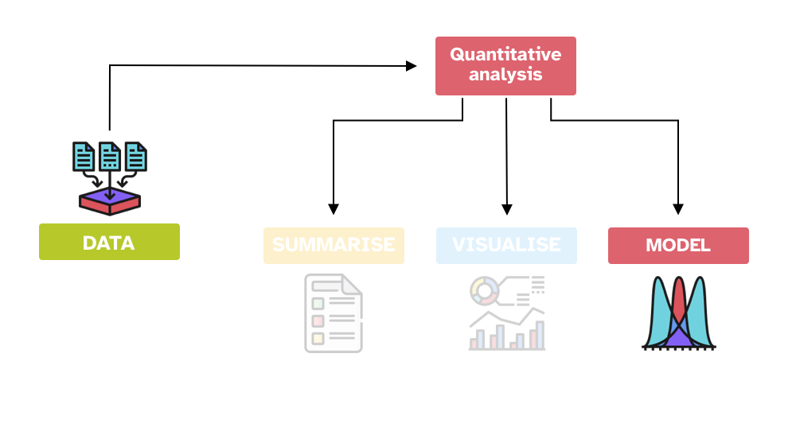

# Gaussian models {#sec-gauss-model}

 

```{r}
#| label: setup
#| include: false

library(tidyverse)
theme_set(theme_light())
library(webexercises)
library(glue)
```



In the previous chapters, you have learned about two of the three main components of quantitative data analysis: data summaries and visualisation.
In this chapter, you will encounter the fundamental concepts of the third component: statistical modelling.
A **statistical model** is a simplified mathematical description of how observed data are generated, together with assumptions about uncertainty in relation to the data-generating process.
In other words, a statistical model uses observed data (your sample) to identify the characteristic of the probability distribution that generates that data in the outside world.

::: callout-tip
### Statistical model

A **statistical model** is a simplified mathematical description of how observed data are generated, together with assumptions about uncertainty in relation to the data-generating process.
:::

In the context of a quantitative research study, a simple objective could be to figure out the values of the parameters of the probability distribution of a variable of interest: Voice Onset Time, number of telic verbs, informativity score, acceptability ratings, reaction times, and so on.
Let's imagine we are interested in understanding more about the nature of reaction times in auditory lexical decision tasks (lexical decision tasks in which the target is presented aurally rather than in writing).
We can revisit the RT data from @tucker2019 to try and address the following research question:

> RQ: In a typical auditory lexical decision task, what are the mean and standard deviation of reaction times (RTs)?

This might look like a trivial question, and in the realm of linguistic research it probably is, but to answer more complex questions, more complex extensions of the simplistic models covered in these chapters are needed.
While all models start with at least a variable, a probability distribution and its parameters, more building blocks (or model components) will be necessary to address specific questions (for example, you might want to deal with predictor variables, non-linear effects, repeated measurements from multiple participants, and so on).
We won't be able to cover everything in here, but you will get at least a solid introduction to the more basic components.

Going back to our research question on reaction times, you might wonder why the mean and the standard deviation?
This is because we are assuming that reaction times (i.e the population of reaction times, rather than our specific sample) are distributed according to a Gaussian probability distribution.
It is usually the onus of the researcher to assume a probability distribution family.
You will learn some heuristics for picking a distribution family later depending on the general type of the variable of interest, but for now we will content ourselves with the Gaussian family.
Learning about statistical modelling requires building your understanding from basic concepts, and it is pedagogically easier to illustrate these concepts with an admittedly simplistic model which uses a Gaussian family.
Do not underestimate the importance of learning the mechanisms of statistical modelling in simple Gaussian models because we will be building on this knowledge in the rest of the textbook.

In statistical notation, we can write:

$$\text{RT} \sim Gaussian(\mu, \sigma)$$

which you can read as: "reaction times are distributed according to a Gaussian distribution with mean $\mu$ and standard deviation $\sigma$".
So the research question above is about finding the values of $\mu$ and $\sigma$.

For illustration's sake, let's assume the sample mean and standard deviation are also the population $\mu$ and $\sigma$: $Gaussian(\mu = 1010, \sigma = 318)$ (we calculated these in @sec-summarise).
@fig-mald-rt-distr shows the empirical probability distribution (in grey, this is a density curve calculated with kernel density estimation) and the theoretical probability distribution (in purple) based on the sample mean and SD: in other words, the purple curve is the density curve of the theoretical probability distribution $Gaussian(1010, 318)$.
We know by now that any sample mean and SD is biased, due to uncertainty and variability.
What we are really after is the values of $\mu$ and $\sigma$ which are the mean and standard deviation of the Gaussian distribution of the *population* of RTs in auditory lexical decision tasks.
In other words, we want to make inference from the sample to the population of RTs.

```{r}
#| label: fig-mald-rt-distr
#| fig-cap: "Empirical and theoretical density distribution of reaction times."
#| code-fold: true

mald <- readRDS("data/tucker2019/mald_1_1.rds")

rt_mean <- mean(mald$RT)
rt_sd <- sd(mald$RT)
rt_mean_text <- glue("mean: {round(rt_mean)} ms")
rt_sd_text <- glue("SD: {round(rt_sd)} ms")
x_int <- 2000

ggplot(data = tibble(x = 0:300), aes(x)) +
  geom_density(data = mald, aes(RT), colour = "grey", fill = "grey", alpha = 0.2) +
  stat_function(fun = dnorm, n = 101, args = list(rt_mean, rt_sd), colour = "#9970ab", linewidth = 1.5) +
  scale_x_continuous(n.breaks = 5) +
  geom_vline(xintercept = rt_mean, colour = "#1b7837", linewidth = 1) +
  geom_rug(data = mald, aes(RT), alpha = 0.1) +
  annotate(
    "label", x = rt_mean + 1, y = 0.0015,
    label = rt_mean_text,
    fill = "#1b7837", colour = "white"
  ) +
  annotate(
    "label", x = x_int, y = 0.0015,
    label = rt_sd_text,
    fill = "#8c510a", colour = "white"
  ) +
  annotate(
    "label", x = x_int, y = 0.001,
    label = "theoretical distribution",
    fill = "#9970ab", colour = "white"
  ) +
  annotate(
    "label", x = x_int, y = 0.0003,
    label = "empirical distribution",
    fill = "grey", colour = "white"
  ) +
  labs(
    subtitle = glue("Gaussian distribution: mean = {round(rt_mean)} ms, SD = {round(rt_sd)}"),
    x = "RT (ms)", y = "Relative probability (density)"
  )
```

You will also appreciate that the theoretical distribution doesn't match well the empirical distribution.
In real research contexts, there can be multiple reasons behind this.
A common misconception is that the family distribution should be chosen on how well the theoretical family matches the empirical distribution.
Sometimes, this can indeed indicate a problem with the chosen family, but in other cases the mismatch could be because of other aspects related to model specification.
For the time being, let's not worry about the potential cause of the mismatch and let's proceed.

## Gaussian models

A statistical tool we can use to obtain an estimate of $\mu$ and $\sigma$ is a Gaussian model.
A Gaussian model is a statistical model that estimates the values of the parameters of a (theoretical) Gaussian distribution, i.e. $\mu$ and $\sigma$.
We can provisionally describe the model using formulae, like this:

$$\begin{aligned}
\text{RT} & \sim Gaussian(\mu, \sigma)\\
\mu & = ...\\
\sigma & = ...\\
\end{aligned}$$

While you don't need a full mathematical grasp of statistical models, it is useful to learn how to read and work with these formulae.
They will make interpretation of the model output more straightforward.

Now, here is where things get interesting.
Bayesian approaches to statistics assume uncertainty in the parameters of the distribution one is estimating.
So not only the observed values of RT are uncertain because they come from a probability distribution, but the parameters of the distribution are themselves uncertain.
You can think of the mean and SD as uncertain variables that need to be estimated from the data.
When we say a variable is uncertain, we describe it using a probability distribution.
So the aim of a Gaussian model is to estimate the probability distributions of the parameters from the data (and the priors), rather than just their values.

$$\begin{aligned}
\text{RT} & \sim Gaussian(\mu, \sigma)\\
\mu & \sim P(\mu_1, \sigma_1)\\
\sigma & \sim P_+(\mu_2, \sigma_2)\\
\end{aligned}$$

We say that $\mu$ comes from a probability distribution $P(\mu_1, \sigma_1)$.
We use a subscript $1$ to differentiate the mean and SD of the main $Gaussian(\mu, \sigma)$ distribution from the mean and SD of the probability distribution of the mean $\mu$.
Similarly, we say that $\sigma$ comes from a probability distribution $P_+(\mu_2, \sigma_2)$: $P_+()$ is a (non-technical) way to indicate that the probability should include only positive values.
Why?
Because SDs can only be positive.
By specifying $P_+()$ we are constraining the probability distribution of $\sigma$ to have positive values only.
In sum, we need to estimate two probability distributions, $P(\mu_1, \sigma_1)$ and $P_+(\mu_2, \sigma_2)$.
These are **posterior probability distributions**, because they are probability distributions that result from the product of prior probability distributions and the evidence from the data.

::: callout-tip
### Gaussian model

A **Gaussian model** is a statistical model of a Gaussian variable $y$, which estimates the mean $\mu$ and SD $\sigma$ of the Gaussian distribution which generates $y$.

$$\begin{aligned}
y & \sim Gaussian(\mu, \sigma)\\
\end{aligned}$$
:::

In the rest of this book, you will be using the default prior probability distributions, or priors for short, as set by brms, the R package we will use to fit Bayesian models.
This means that you will not have to worry about choosing priors while you start dipping your toes into the ocean of Bayesian statistics.
However, you can learn about priors of Gaussian models in the Going further box at the end of this chapter, but after that you can safely assume that priors are handled by brms for you and you should not worry until after you completed this course.
Note that in actual research, thinking about priors is a necessary step, even if one ends up using the default brms priors.

In the next chapter you will fit the Gaussian model of RTs using brms, with the default priors as set by the package.

::: callout-note
## Quiz 1

```{r}
#| label: quiz-1
#| results: asis
#| echo: false

opts_1 <- c(
  "Because $\\sigma$ is always zero.",
  answer = "Because $\\sigma$ represents variability, which cannot be negative.",
  "Because $\\mu$ is also constrained to be positive."
)

cat("a. Why is the distribution of $\\sigma$ constrained to positive values only?", longmcq(opts_1))

opts_2 <- c(
  "Because RTs are Gaussian.",
  "Because it is easier to run the model.",
  answer = "Because a Gaussian distribution is a safe assumption to make."
)

cat("b. Why have we assumed that reaction times are Gaussian?", longmcq(opts_2))

opts_3 <- c(
  "The data alone.",
  "Theoretical distributions chosen by the researcher before collecting data.",
  answer = "The combination of priors and observed data."
)

cat("c. In Bayesian modeling, posterior probability distributions are described as:", longmcq(opts_3))
```
:::

::: {.callout-important collapse="true"}
## Aside: Writing maths in Quarto

Quarto supports LaTeX mathematical notation.
Inline maths can be written by surrounding maths expression with dollar signs `$`.
For example, if you write `$y \sim Gaussian(\mu, \sigma)$` you get $y \sim Gaussian(\mu, \sigma)$.

For display maths, use two dollar signs `$$`.
For example:

```         
$$
\begin{aligned}
\text{RT} & \sim Gaussian(\mu, \sigma)\\
\mu & \sim P(\mu_1, \sigma_1)\\
\sigma & \sim P_+(\mu_2, \sigma_2)\\
\end{aligned}
$$
```

gives you

$$\begin{aligned}
\text{RT} & \sim Gaussian(\mu, \sigma)\\
\mu & \sim P(\mu_1, \sigma_1)\\
\sigma & \sim P_+(\mu_2, \sigma_2)\\
\end{aligned}$$

You can find a full list of symbols here: <https://www.cmor-faculty.rice.edu/~heinken/latex/symbols.pdf>.
:::

::: {.callout-important collapse="true"}
## Going further: Choosing priors for Gaussian models

How do we go about choosing priors for the model above?
Once you know that you are trying to estimate the (posterior) probability distribution of $\mu$ and $\sigma$ you also know that you should choose a prior for each of these two parameters.
In other words, each parameter in the model gets its own prior.
But what is a prior exactly?
It is just a probability distribution!

With Gaussian models, it is common to use Gaussian probability distributions as the priors for the mean and SD of the Gaussian distribution.
Yes, you read right: we use Gaussian distributions as priors for the parameters of the Gaussian distribution.
Note that priors should be chosen *before* seeing the data.
Here, we have seen the data many times, so let's just pretend we haven't.
For example, let's say that we believe that, prior to seeing the data, we are 95% confident that the mean RT is a value between 500 and 1300 ms. Why this range?
Well, it seems reasonable based on my experience with reaction times, but in actual research your would put much more thought into this.
We can now find the value of the mean and SD of a Gaussian distribution the 95% interval of which is between 500 and 1300.
This is fairly easy: according to the so-called empirical rule, a 95% (central) interval of a Gaussian distribution is approximately the interval defined by $mu - 2 \sigma$ (lower boundary) and $\mu + 2 \sigma$ (upper boundary).[^ch-gauss-model-1]
Between the lower and upper boundary of a 95% interval we thus have 4 times the SD $\sigma$.
We can thus take the range $1300 - 500 = 800$ and divide that by 4, $800 / 4 = 200$.
200 is our $\sigma$.
We can easily get the mean by taking the mean of the lower and upper boundary: $(500 + 1300) / 2 = 900$, our $\mu$.

In sum, our prior expectation is that the mean RT is a value from a Gaussian distribution $Gaussian(900, 200)$.
This distribution is shown in @fig-prior-mu.

```{r}
#| label: fig-prior-mu
#| fig-cap: "The prior for $\\mu$."
#| code-fold: true

xseq <- seq(0, 2000)

ggplot() +
  aes(x = xseq, y = dnorm(xseq, 900, 200)) +
  geom_path(colour = "darkgreen", linewidth = 1) +
  labs(
    x = NULL, y = "Density"
  )
```

Once you have the lower and upper boundaries of your prior for the mean it is easy to find the mean and SD of the prior.
In practice, deciding on the boundaries is the hardest part.

We can now pick a prior for $\sigma$, the overall standard deviation.
Let's say the SD can be described by a truncated Gaussian prior probability with mean 0 and SD 200.
Why truncated?
Because as we said earlier, SDs can only be positive so we truncate the distribution to include only the positive side.
It is also common for priors on standard deviations to set the mean to 0 (to understand the reason, you will have to learn more about priors, so we won't delve into this).
As a rough rule, the 95% interval of a half-Gaussian distribution with mean 0 is between 0 and twice the SD $2 \sigma$, so in our case between 0 and 400 ms.[^ch-gauss-model-2] Our truncated Gaussian prior distribution is shown in @fig-prior-sigma. As in the previous chapter, we can signal that the distribution is truncated to positive values by adding a subscript $+$: $Gaussian_+$.

```{r}
#| label: fig-prior-sigma
#| fig-cap: "The prior for $\\sigma$."
#| code-fold: true

xseq <- seq(0, 750)

ggplot() +
  aes(x = xseq, y = dnorm(xseq, 0, 200)) +
  geom_path(colour = "darkorange", linewidth = 1) +
  labs(
    x = NULL, y = "Density"
  )
```

We can rewrite the model formulae above to indicate our priors:

$$\begin{aligned}
\text{RT}  & \sim \text{Gaussian}(\mu, \sigma) \\
\mu        & \sim \text{Gaussian}(900, 200)   & \text{[Prior for $\mu$]} \\
\sigma     & \sim \text{Gaussian}_+(0, 200) & \text{[Prior for $\sigma$]}
\end{aligned}$$
:::

[^ch-gauss-model-1]: Strinctly speaking, a 95% central interval of a Gaussian distribution is defined by the boundaries $\mu \pm 1.96 \sigma$, but as a quick and rough estimate, $2 \sigma$ is fine.

[^ch-gauss-model-2]: Technically, this is the Highest Density Interval (HDI) rather than the quantile-based central interval.
    The HDI of a distribution is the narrowest interval that contains a specific percentage of the probability mass.
    In symmetric probability distributions, like the Gaussian, the HDI and the central quantile-based interval are equivalent, but they differ in non-symmetric distributions like the truncated Gaussian distribution of the prior for $\sigma$.
