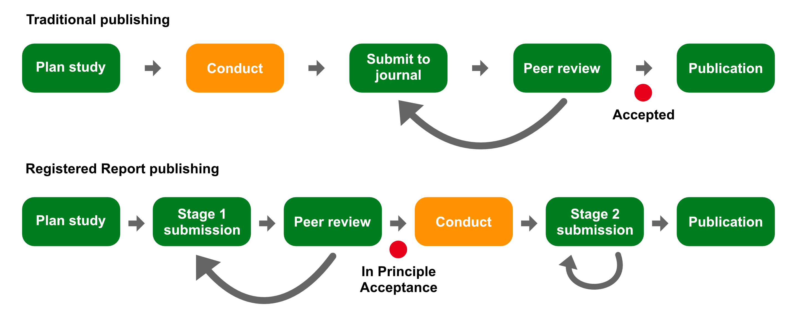

# Open Research {#sec-open-research}

@sec-res-cycle introduced the concept of Questionable Research Practices: these are practices that, whether intentionally or not, negatively affect the research enterprise [@simmons2011; @morin2015; @flake2020].
These, combined with theoretical underspecification typical of most research [@yarkoni2022; @scheel2022; @frankenhuis2023], have contributed towards what we can call a "research crisis" [@pashler2012; @gelman2014a; @schooler2014; @fanelli2017; @amrhein2019; @starns2019; @yarkoni2022].
In response to this research crisis, or crises, researchers have initiated a movement known as Open Research [@munafo2017; @cruwell2019], also called Open Scholarship and Open Science (some researchers find Open Science less inclusive, because of how loaded the term "science" is, so Open Research or Scholarship are now preferred).
Open Research is a movement that stresses the importance of a more honest and transparent research by promoting a series of research principles and by warning from common, although not necessarily intentional, questionable practices and misconceptions.
This chapter explains what Open Research entails.
See @cruwell2019 for a general overview and @casillas2025 for Open Research in linguistics.

## Reliability of results

A core principle of Open Research is about reliability of results presented in research literature.
Results can be considered **reliable** if they meet the following criteria: reliable results are **reproducible, replicable, robust and generalisable**.
These criteria are determined by the combination of two aspects of research: the data and the analysis of such data.
Imagine an independent team of researchers: they pick an existing published study and want to check the reliability of the results presented in the study.
As far as the data are concerned, they can re-use the same data of the original study or collect new data following the same protocol of the original study.
In terms of data analysis, they can use the same analysis pipeline of the original study or use a different method.
When you combine data and analysis choice together, you get a matrix of criteria for reliable results, as shown in @fig-reliable.

 (CC BY 4.0).](img/repli-matrix.png){#fig-reliable fig-align="center"}

When an independent researcher takes the data of the original study, applies the same analytical pipeline and obtains the same results as reported in the original study, we say that the results are **reproducible**.
There is also a more specific meaning, which is computational reproducibility, by which the same data and computer code produce the same results.
If independent researchers use the same data collection protocol and apply the same analysis workflow, but they collect new data and obtain the same results, we say the original results are **replicable**.
With the same data but a different analysis pipeline, the original results are **robust** if they are the same as the one obtained with a different pipeline.
Finally, with new data and a different analysis the results are **generalisable** if you obtain the same results of the original study.

Together, reproducibility, replicability, robustness and generalisability are necessary (but not sufficient) criteria to ensure reliable results.
Unfortunately, the current situation in terms of reproducibility and replicability is dire: the level of (computational) reproducibility is low in many fields, including linguistics [@bochynska2023] and the replicability success rates are low.
@opensciencecollaboration2015 found that, in psychology, a large portion of replications produced weaker evidence than the original studies that were replicated.
Replication success is more difficult to assess in linguistics, given the few direct replication attempts [@kobrock2023].
Less is known about robustness and generalisability, although @yarkoni2022 presents convincing arguments that we can expect a generalisability crisis as well.
Overall, we are facing several reliability crises, which are part of the wider research crisis.

## Sharing research compendia

A **research compendium** is collection of files, data, materials, images, computer code, analysis outputs, research notebooks, etc. of a research project.
A simple practice encouraged by Open Research advocates is to openly share a project's research compendium so that independent researchers can access it and re-use its components.
Sharing a research compendium, especially data, of course is intertwined with ethics and obtaining proper consent from participants or any other source.
@bochynska2023 report that only less than 10% of the surveyed linguistic papers shared a compendium and @laurinavichyute2022 urge authors to share not only data but also the analysis code.
In other words, there is a lot of room for improving the sharing of research compendia in linguistics.

There are many online repositories that allow researchers to share their research compendia.
A commonly used service is the Open Science Framework: <https://osf.io/>.
An example of research compendium on OSF can be found here: <https://osf.io/3bmcp/> [this is the compendium of @coretta2023].
Zenodo also allows you to upload research compendia: <https://zenodo.org>.
There are other specialised repositories like the Tromsø Repository of Language and Linguistics (TROLLing): <https://dataverse.no/dataverse/trolling>.

## Pre-registration and Registered Reports

**Pre-registration** is the procedure by which you register your study design including analysis pipeline on an online service before conducting the study [@lakens2024].
The pre-registration is time-stamped and can be linked in the final publication.
The aim of a pre-registration is to make the research process more transparent, since the study plan is shared in advance [@haven2019; @kavanagh2019; @claesen2021; @roettger2021].

A more involved alternative to pre-registration is a new academic article format: Registered Reports [@chambers2015; @karhulahti2022a; @karhulahti2023; @lakens2024; @liu2025].
@fig-rr compares traditional publishing with publishing with Registered Reports.
In traditional publishing, you plan and conduct a study, write the paper and submit that to a journal for peer-review.
After one or more rounds of review, if the paper is accepted, it is published in the journal.
On the ohter hand, Registered Reports are peer-reviewed in two stages.
The Stage 1 manuscript contains a literature review and a methodology that details the research background and the study plan.
The Stage 1 manuscript is submitted to a journal for peer-review.
If granted In Principle Acceptance, the authors carry out the study and then complete the writing of the paper resulting in a Stage 2 manuscript.
This is peer-reviewed to check that the original protocol has been followed by the authors, and if so the paper is accepted for publication, independent of the results.

{#fig-rr fig-align="center"}

Register Reports work for a variety of research types, from quantitative to qualitative, from exploratory to corroboratory.
Note that authors do have the chance to perform analyses that were not planned in the Stage 1 manuscript, as long as they are clearly labelled as exploratory or not pre-registered.
There is hope that Registered Reports can positively contribute to making research more robust and mitigate the effects of the researchers' degrees of freedom.
Of course, they are not a one-shot solution, but just one tool among many that have been proposed to improve the quality of research.
As of today, several linguistic journals accept Registered Reports, but the format is still not widely adopted.

## Version control systems

A version control system is software that allows users to take incremental "snapshots" of computer files and to revert to any snapshot in time.
Versioning systems are primarily thought for programming work (developing software) but they have been increasingly adopted in (knowledge-oriented, non-applied) research given that a lot of the research process is based on computational aspects (managing data, analysing data with code, writing manuscripts, etc).
A commonly used version control system is git (<https://git-scm.com>).
git allows you to track changes in files, commit those changes into "snapshots" and also maintain multiple branches of the same repository.
Note that git is software that runs on your computer.
git repositories can be shared and managed online with other services, like GitHub (<https://github.com>) or GitLab (<https://about.gitlab.com>).
The code and the website of this textbook are hosted on GitHub: <https://github.com/stefanocoretta/qdal>.

One of the advantages of using a version control system is that it helps ensuring computational reproducibility.
Everything needed for code to be run is managed by the version control system and independent researchers can access and clone the versioned repository and re-use the code.
git is very efficient with textual files, of the kind you would use for code, but it is less ideal with large data files.
The software Data Version Control (DVC, <https://dvc.org>) was developed to more efficiently version larger files.
Note that while for git repositories there are online services like GitHub and GitLab, for DVC repositories a dedicated server does not exist so usually "remote" DVC repositories have to be hosted on other servers.

## Licences and re-use

When sharing research compendia, it is important to specify a license that explains how the contents of the research compendium can be re-used.
So just sharing the compendium does not automatically make it "open" if it can't be reused.
Commonly used licences are the Creative Common licences (<https://creativecommons.org/share-your-work/>).
In particular the CC-BY licence allows re-use of compendia provided attribution of the original authors is given.
For software more specifically, there are several licences like the MIT license and the GNU licence.
When sharing compendia you should carefully think about which licence to distribute the compendia under.

## Summary

::: {.callout-note appearance="simple"}
- Open Research is a movement that stresses the importance of a more honest and transparent research.

- Core principles of Open Research are sharing research compendia under permissive licences, ensuring computational reproducibility, and registering study plans with pre-registrations or Registered Reports.

- @cruwell2019 is a review of Open Research principles and resources.
:::
