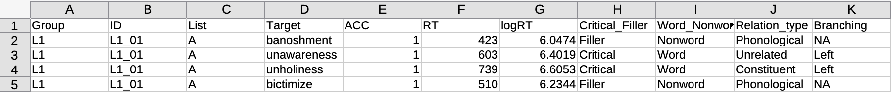

# Read data in R {#sec-read-data}


```{r}
#| label: setup
#| include: false

library(tidyverse)
library(webexercises)
```

## Files, folder and file extensions

Files saved on your computer live in a specific place.
For example, if you download a file from a browser (like Google Chrome, Safari or Firefox), the file is normally saved in the `Download` folder.
But where does the `Download` folder live?
Usually, in your user folder!
The user folder normally is the name of your account or a name you picked when you created your computer account.
In my case, my user folder is simply called `ste`.

::: callout-tip
#### User folder

The **user folder** is the folder with the name of your account.
:::

::: {.callout-note collapse="true"}
#### How to find your user folder name

**On macOS**

- Go to Finder \> Preferences/Settings.

- Go to `Sidebar`.

- The name next to the house icon is the name of your home folder.

**On Windows**

- Right-click an empty area on the navigation panel in File Explorer.

- From the context menu, select the 'Show all folders' and your user profile will be added as a location in the navigation bar.
:::

::: callout-warning
#### Enable all extensions

Before moving on, we recommend you enable the option to show all file extensions in the File Explorer/Finder.

Follow the instructions here:

- Windows: [show extensions](https://support.microsoft.com/en-us/windows/common-file-name-extensions-in-windows-da4a4430-8e76-89c5-59f7-1cdbbc75cb01){.uri}.

- macOS (For all files): [show extensions](https://support.apple.com/en-gb/guide/mac-help/mchlp2304/mac#:~:text=In%20the%20Finder%20on%20your,“Show%20all%20filename%20extensions”.){.uri}.
:::

So, let's assume I download a file, let's say `big_data.csv`, in the `Download` folder of my user folder.
Now we can represent the location of the `big_data.csv` file like so:

```         
ste/
└── Downloads/
    └── big_data.csv
```

To mark that `ste` and `Downloads` are folders, we add a final forward slash `/`.
That simply means "hey! I am a folder!".
`big_data.csv` is a file, so it doesn't have a final `/`.
Instead, the file name `big_data.csv` has a **file extension**.
The file extension is `.csv`.
A file extension marks the type of file: in this the `big_data` file is a `.csv` file, a comma separated value file (we will see an example of what that looks like later).
The name of the file is of course up to the user, but if you change the file extension you might have trouble later reading the file, so don't change the file extension part yourself!

Different file types have different file extensions:

- Excel files: `.xlsx`.
- Plain text files: `.txt`.
- Images: `.png`, `.jpg`, `.gif`.
- Audio: `.mp3`, `.wav`.
- Video: `.mp4`, `.mov`, `.avi`.
- Etc...

::: callout-tip
#### File extension

A file extension is a sequence of letters that indicates the type of a file and it's separated with a `.` from the file name.
:::

### File paths

Now, we can use an alternative, more succinct way, to represent the location of the `big_data.csv`:

`ste/Downloads/big_data.csv`

This is called a **file path**!
It's the path through folders that lead you to the file.
Folders are separated by `/` and the file is marked with the extension `.csv`.

::: callout-tip
#### File path

A **file path** indicates the location of a file on a computer as a path through folders that lead you to the file.
:::

Now the million pound question: where does `ste/` live on my computer???
User folders are located in different places depending on the operating system you are using:

- On **macOS**: the user folder is in `/Users/`.

  - You will notice that there is a forward slash also before the name of the folder. That is because the `/Users/` folder is a top folder, i.e. there are no folders further up in the hierarchy of folders.
  - This means that the full path for the `big_data.csv` file on a computer running macOS would be: `/Users/ste/Downloads/big_data.csv`.

- On **Windows**: the user folder is in usually `C:/Users/`, but the drive letter might not be `C`.
  We will use `C` for convenience here.

  - You will notice that `C` is followed by a colon `:`. That is because `C` is a drive, which contains files and folders. `C:` is not contained by any other folder, i.e. there are no other folders above `C:` in the hierarchy of folders.
  - This means that the full path for the `big_data.csv` file on a Windows computer would be: `C:/Users/ste/Downloads/big_data.csv`.

When a file path starts from a top-most folder, we call that path the **absolute** file path.

::: callout-tip
#### Absolute path

An **absolute path** is a file path that starts with a top-most folder.
:::

There is another type of file paths, called **relative** paths.
A relative path is a partial file path, relative to a specific folder.
You can learn how to use relative paths in @sec-read-data.
Importing files in R is very easy with the tidyverse packages.
You just need to know the file type (very often the file extension helps) and the location of the file (i.e. the file path).

## Tabular data

::: callout-warning
### Important

When working through the book, always **make sure you are in a Quarto Project** by checking the top-right corner of RStudio.
If you see the name of the project you are fine, if you see `Project (none)` then you are not in the Quarto Project.
Close RStudio and open the Quarto project.
:::

Data comes in a lot of different formats, shape and sizes.
However, the most common way to store data used in quantitative analysis is so-called tabular data.
R is especially designed to work with such data.
Tabular (aka rectangular) data is simply data in the form of a table, with columns and rows.

::: callout-tip
### Tabular data

**Tabular data** is data that has a form of a table: i.e. values structured in columns and rows.
:::

Tabular data can be saved in different file formats.
Different file formats have different file extensions.
The **comma separated values format** (file extension `.csv`) is the best format to save data in because it is basically a plain text file, it's quick to parse, and can be opened and edited with any software (plus, it’s not a proprietary format like `.docx` or `.xlsx`---these formats are specific to particular commercial software).

This is what a `.csv` file looks like when you open it in a text editor (showing only the first few lines).
The file contains tabular data (data that is structured as columns and rows, like a spreadsheet).

``` txt
Group,ID,List,Target,ACC,RT,logRT,Critical_Filler,Word_Nonword,Relation_type,Branching
L1,L1_01,A,banoshment,1,423,6.0474,Filler,Nonword,Phonological,NA
L1,L1_01,A,unawareness,1,603,6.4019,Critical,Word,Unrelated,Left
L1,L1_01,A,unholiness,1,739,6.6053,Critical,Word,Constituent,Left
L1,L1_01,A,bictimize,1,510,6.2344,Filler,Nonword,Phonological,NA
```

This is what the file would look like when layed out as a table.

{fig-align="center" width="700"}

To separate the values of each column, a `.csv` file uses a comma `,` (hence the name "comma separated values") to separate the values in every row.
The first line of the file indicates the names of the columns of the table:

``` txt
Group,ID,List,Target,ACC,RT,logRT,Critical_Filler,Word_Nonword,Relation_type,Branching
```

There are 11 columns.
The rest of the rows is the data, i.e. the values of each column separated by commas.

``` txt
L1,L1_01,A,banoshment,1,423,6.0474,Filler,Nonword,Phonological,NA
L1,L1_01,A,unawareness,1,603,6.4019,Critical,Word,Unrelated,Left
L1,L1_01,A,unholiness,1,739,6.6053,Critical,Word,Constituent,Left
L1,L1_01,A,bictimize,1,510,6.2344,Filler,Nonword,Phonological,NA
```

This might look a bit confusing, but you will see later that, after importing this type of file, you can view it as a nice spreadsheet (as you would in Excel), like in the figure above.

Another common type of tabular data file is **spreadsheets**, like spreadsheets created by Microsoft Excel or Apple Numbers.
These are all proprietary formats that require you to have the software that were created with if you want to modify them.
Portability and openness are important aspects of conducting research, so that using open and non-proprietary file types makes your research more accessible and doesn't privilege those who have access to specific software (remember, R is free!).
Despite of this, a lot of data is shared as Excel files.

There are also variations of the comma separated values type, like **tab separated values** files (`.tsv`, which uses tab characters instead of commas) and **fixed-width** files (usually `.txt`, where columns are separated by as many white spaces as needed so that the columns align).

### Non-tabular data

Of course, R can import also data that is not tabular, like map data and complex hierarchical data, including XML, HTML and json data.
We will not cover these types of data, but you can check out the resources in the Extra box.

::: {.callout-important collapse="true"}
#### Going further: Non-tabular data

- See Chapters 21-24 of [R for Data Science](https://r4ds.hadley.nz).

- Look up the [sf](https://r-spatial.github.io/sf/) package for mapping.
:::

### `.rds` files

R has a special way of saving data: `.rds` files.
`.rds` files allow you to save an R object to a file on your computer, so that you can read that file back in when you need it.
A common use for `.rds` files is to save tabular data that you have processed so that it can be readily used in many different scripts or even by other people, but `.rds` files can contain any type of R objects, also lists (so not only tabular data).
In the following sections you will learn how to import (aka read) three types of data: `.csv`, Excel and `.rds` files.

::: callout-note
### Quiz 1

```{r}
#| label: quiz-1
#| results: asis
#| echo: false

opts_1 <- c(
  "a. A file with 3 columns and 100 rows.",
  answer = "b. An HTML file.",
  "c. An Excel spreadsheet."
)

cat("a. Which of the following is not tabular data.", longmcq(opts_1))
cat("b. Non-tabular data can be saved to `.rds` files.", torf(TRUE))
```
:::

## Get the data

The data used in this textbook come from a variety of published and unpublished linguistic studies.
You can download the data files from the [QML Data](https://uoelel.github.io/qml-data/) website according to the following instructions.

::: callout-warning
### How to get the data

1.  Download the zip archive with all the data by clicking on the following link (if this doesn't work, right-click and choose "Save linked file" or similar): [data.zip](https://uoelel.github.io/qml-data/data.zip).
    The data is in a zip archive.

2.  Unzip the zip file to extract the contents.
    (If you don't know how to do this, search for it online for your operating system! Zip archives are a very common way of distributing data and it is important to know how to use them).

3.  Create a folder called `data/` (the slash is there just to remind you that it's a folder, but you don't have to include it in the name) in the Quarto project you are using for the course.
    You can do so in two different ways:

    - You can click on the `New Folder` button in the `Files` panel (bottom-right) in RStudio, set the name to `data` (do not include the slash `/`) and click `OK`.
      The folder will be created within the current folder shown in the Files list.

    - Since Quarto Projects are just folders on your computer, you can create a new folder as you would with any other folder from your computer File Explorer/Finder.

4.  Move the contents of the `data.zip` archive into the `data/` folder.

    1.  Open a Finder or File Explorer window.

    2.  Navigate to the folder where you have extracted the zip file (it will very likely be the `Downloads/` folder).

    3.  Copy the contents of the zip file.

    4.  In Finder or File Explorer, navigate to the Quarto project folder, then the `data/` folder, and paste the contents in there.
        (You can also drag and drop if you prefer.)
:::

The rest of this chapter will assume that you have created a folder called `data/` in the Quarto project folder and that the files you downloaded are in that folder.
The data folder should like something like this:

```         
data/
└── cameron2020/
    └── gestures.csv
└── coretta2018/
    └── formants.csv
    └── token-measures.csv
└── ...
```

I recommend that you start being very organised with your files in other projects from now on, whether it's for a course or your dissertation or anything else.
I also suggest to avoid overly nested structures (folders in folders in folders in folders...), unless strictly necessary.

## Organising your files

The [Open Science Framework](https://osf.io) has the [following recommendations](https://help.osf.io/article/147-organizing-files) that can be applied to any type of research project.

- Use **one folder** per project.
  The project folder will also be your RStudio/Quarto project folder.
  Ideally, the project folder should have all the files related to the project (one exception is PDFs of papers that form the literature background of the project: for those I recommend using bibliography managing software, like the free [Zotero](https://www.zotero.org) or [JabRef](https://www.jabref.org)).

- Separate **code** from **data**.
  A general recommendation is to have a folder `code/` or `scripts/` with all the code files (you will start writing your code in script files from @sec-scripts) of the project and a folder `data/` that has all the data.
  This makes keeping files in order easier, since everything has its natural place.

- Separate **raw data** from **derived data**.
  Raw data is data that you have gathered that, if lost, is lost for ever.
  Derived data is any data that is derived from raw data and that can be derived again (for example by running a script) if it's deleted or corrupted.

- Make **raw data read-only**.
  You should assume that anything can happen to raw data, so you should treat it as "read-only".

To summarise, these recommendations suggest to have a folder for your research project/course/else, and inside the folder two more folders: one for data and one for code.
The `data/` folder could further contain `raw/` for raw data (data that should not be lost or changed, for example collected data or annotations) and `derived/` for data that derives from the raw data, for example through automated data processing.

It might be useful to also have a separate folder called `figs/` or `img/` to save figures and plots.
Of course which folders you will have it's ultimately up to you and needs will vary depending on the nature and practical aspects of each study.

## Read `.csv` files

In this section, you will learn how to read `.csv` files.
Reading `.csv` files is very easy.
You can use the `read_csv()` function from a collection of R packages known as the [tidyverse](https://www.tidyverse.org).
Specifically, the `read_csv()` function is from the [readr](https://readr.tidyverse.org) package, one of the tidyverse packages.
Installing the tidyverse packages is easy: you just need to install the **tidyverse** package and that will take care of installing the most important packages in the collection (called the ["core" tidyverse packages](https://www.tidyverse.org/packages/)).
Note that installation of the core tidyverse packages can take some time (but remember that you do this only *once*).
Install the tidyverse packages now with `install.packages("tidyverse")`.

::: callout-important
### Did you open the Quarto project?

Before moving on, make sure that you have opened the RStudio Quarto project correctly (see warning at the beginning of the chapter).
:::

Now that you have ensured the tidyverse packages are available, let's read in data from @song2020.
The study consists of a lexical decision task in which participants were first shown a prime, followed by a target word for which they had to indicate whether it was a real word or a nonce word.
The prime word belonged to one of three possible groups, each of which refers to the morphological relation of the prime and the target word.
We will get back to this data in later chapters, so for now it is sufficient if you just read the paper's abstract to get a general idea of the research context.

The `read_csv()` function from the readr package only requires you to specify the file path as a string (remember, strings are quoted between `" "`, for example `"year_data.txt"`).
The data to be read are in the `data/` folder, in `song2020/shallow.csv`.
On my computer, the file path of `song2020/shallow.csv` is `/Users/ste/qdal/data/song2020/shallow.csv`, but on your computer the file path will be different, of course.
However, you will learn a trick below, i.e. relative paths, that allows you to specify file paths in a shortened form.

````{=html}
<!-- For this trick to work, you have to change a setting of the Quarto project: the setting instructs RStudio to always run (i.e. execute) code with the working directory set as the project folder (more on working directories below). Here is how to enable this setting.

::: callout-warning
### Set execute directory

-   Open the `_quarto.yml` file. This is the file that contains the settings of the Quarto project.

-   At the top of the file you will see something like this:

``` yaml
project:
  title: "my-proj"
```

-   Add the line as below (make sure you keep the indentation!):

``` yaml
project:
  title: "my-proj"
  execute-dir: project
```
:::
-->
````

Note that while the `read_csv()` function does read the data in R, you must assign the output of the `read_csv()` function (i.e. the data we are reading) to a variable, using the assignment arrow `<-`, just like we were assigning values to R variables in previous chapters.
And since the `read_csv()` is a function from the tidyverse, you first need to attach the tidyverse packages with `library(tidyverse)` (remember, you need to attach packages **only once** per session).
This will attach the core tidyverse packages, including readr.
Of course, you can also attach the individual packages directly: `library(readr)`.
If you use `library(tidyverse)` there is no need to attach individual tidyverse packages.

Run the code below in the R Console.
The `read_csv()` line will print information about the data and read the data into `shallow`.

```{r}
#| label: read-shallow

library(tidyverse)

shallow <- read_csv("./data/song2020/shallow.csv")
```

If you look at the `Environment` tab, you will see `shallow` listed under `Data`.
You can preview the data by clicking on the name of the data in the `Environment` tab.
A `View` tab will be opened in the top-left panel of RStudio and you will see a nicely formatted table, as you would in a programme like Excel.
We will dive into this data later, so just have a peek for now.

::: callout-tip
### Data frames and tibbles

In R, a data table is called a **data frame**.

**Tibbles** are special data frames created with the read functions from the tidyverse.
If you are curious about the difference, check [this page](https://cran.r-project.org/web/packages/tibble/vignettes/tibble.html#:~:text=There%20are%20three%20key%20differences,%2C%20subsetting%2C%20and%20recycling%20rules.).

In this textbook, "data frame" and "tibble" will be used interchangeably (since we are using the read functions from the tidyverse, all resulting data frames will be tibbles).
:::

But wait, what is that `"./data/song2020/shallow.csv"`?
That's a **relative path**.
Let's understand the concept of relative paths now.

### Relative paths

File paths can be specified in two formats.
One format is called **absolute** file path.
An absolute file path include *all* folders from the top-most folder, which is normally your computer's hard drive.
For example, `/Users/ste/qdal/data/song2020/shallow.csv` from above is an absolute path.
You know it's an absolute path because it starts with the forward slash `/`.
This means that there isn't anything above `Users/`: it's the top-most folder.
A downside of absolute paths is that they are not portable: if I move the `qdal/` folder to `ste/Documents` then I need to change every occurrence in my scripts to `/Users/ste/Documents/qdal/data/song2020/shallow.csv`.
Moreover, when you share your research code (and you should!), using absolute paths means that each person that wants to run the code has to update the absolute path to reflect their own.

A solution is to use **relative paths**.
Relative paths work by including the path only from within a specific folder.
Whichever folders contain that specific folder do not matter.
The specific folder is called the **working directory**.
When you are using Quarto projects, the working directory is the project folder, i.e. the folder with the `.Rproj` and `_quarto.yml` files.

::: callout-tip
#### Working directory

The **working directory** is the folder which relative paths are relative to.

When using Quarto projects, the working directory is the project folder.
:::

Relative paths are specified by starting the path with `./`.
For example, if your project is called `awesome_proj` and it's in `Downloads/stuff/`, then if you write `read_csv("./data/results.csv")` R knows you mean to read the file in `Downloads/stuff/awesome_proj/data/results.csv`!
This works because when working with Quarto projects, all relative paths are relative to the working directory which is automatically set to the project folder.

::: callout-tip
#### Relative path

A **relative path** is a file path that is relative to a folder (the working directory).
The folder the path starts at is represented by `./`.
:::

The code `read_csv("./data/song2020/shallow.csv")` above will work because you are using a Quarto project and inside the project folder there is a folder called `data/` and in it there's the `song2020/shallow.csv` file.
When you run the code, R will "expand" the relative path to the absolute path and correctly find the file to read.
I strongly recommend you to use Quarto projects and relative paths to make your work portable.
As hinted at above, the benefit of Quarto projects and relative paths is that, if you move your project or rename it, or if you share the project with somebody, all the paths will just work because they are relative.

::: callout-warning
#### Exercise 1: Get the working directory

You can get the current working directory with the `getwd()` command.

Run it now in the Console!
Is the returned path the project folder path?

If not, it might be that you are not working from a Quarto project.
Check the top-right corner of RStudio: is the project name in there or do you see `Project (none)?`

If it's the latter, you are not in a Quarto project, but you are running R from somewhere else (meaning, the working directory is somewhere else).
If so, close RStudio and open the project.
:::

::: callout-note
### Quiz 2

```{r}
#| label: quiz-2
#| results: asis
#| echo: false

opts_2 <- c(
  "a. `/thesis/data/raw/data.csv`",
  "b. `./projects/thesis/data/raw/data.csv`",
  "c. `./data/raw/data.csv`",
  answer = "d. `./thesis/data/raw/data.csv`"
)

cat("1. Given the following absolute path `/Users/raj/projects/thesis/data/raw/data.csv` and the working directory `/Users/raj/projects/`, which of the following paths is the correct one to read the `data.csv` file?", longmcq(opts_2))
```
:::

````{=html}
<!--
The `shallow` data frame contains 11 columns (called variables in the `Environment` tab). The 11 columns are the following:

-   `Group`: `L1` vs `L2` speakers of English.
-   `ID`: Subject unique ID.
-   `List`: Word list (A to F).
-   `Target`: Target word in the lexical decision trial.
-   `ACC`: Lexical decision response accuracy (`0` incorrect response, `1` correct response).
-   `RT`: Reaction times of response in milliseconds.
-   `logRT`: Logged reaction times.
-   `Critical_Filler`: Whether the trial was a `filler` or `critical`.
-   `Word_Nonword`: Whether the Target was a real `Word` or a `Nonword`.
-   `Relation_type`: The type of relation between prime and target word (`Unrelated`, `NonCostituent`, `Constituent`, `Phonological`).
-   `Branching`: Constituent syntactic branching, `Left` and `Right` (shout out to Charlie Puth).


::: callout-note
### Quiz 3

```{r}
#| label: quiz-3
#| results: asis
#| echo: false

opts_3 <- c(
   "11",
   "650",
   answer = "6500"
)

cat("How many rows does `shallow` have?", longmcq(opts_3))
```
:::
-->
````

## Read Excel sheets

To read an Excel file we need first to attach the [readxl](https://readxl.tidyverse.org/index.html) package.
It should already be installed, because it comes with the tidyverse.
If not, install it.
Run the following code in the Console to attach the package.

```{r}
#| label: readxl

library(readxl)

```

Now we can use the `read_excel()` function.
Let's read the file.

```{r}
#| label: los2023

relatives <- read_excel("./data/los2023/relatives.xlsx")

```

Now you can view the tibble `relatives` in the RStudio Viewer.
Note that if the Excel file has more than one sheet, you can specify the sheet number when reading the file (the default is `sheet = 1`).

```{r}
#| label: los2023-2

relatives_2 <- read_excel("./data/los2023/relatives.xlsx", sheet = 2)
```

The second sheet in `los2023/relatives.xlx` contains the description of the columns in the first sheet.

## Import `.rds` files

Another useful type of data files is a file type specifically designed for R: `.rds` files.
Each `.rds` file can only contain a single R object, like a tibble.
You can read `.rds` files with the `readRDS()` function.

```{r}
#| label: glot-status

glot_status <- readRDS("./data/coretta2022/glot_status.rds")
```

As always, you need to assign the output of the function to a variable, here `glot_status`.

::: callout-tip
#### `.rds` files

`.rds` files are a type of R file which can store any R object and save it on disk.

R objects can be saved to an `.rds` file with the `saveRDS()` function and they can be read with the `readRDS()` function.
:::

View the `glot_status` tibble now.
It is also very easy to save a tibble to an `.rds` file with the `saveRDS()` function.
For example:

```{r}
#| label: save-rds
#| eval: false

saveRDS(shallow, "./data/song2020/shallow.rds")
```

The first argument is the name of the tibble object and the second argument is the file path to save the object to.

## Reading multiple tabular files

Depending on how the tabular data is output or created, you might at times have data that is split into multiple files.
This is common for example when each file is from a single participant.
Reading multiple files in R is easy, assuming that each file has exactly the same structure.

We will read files from Coretta [-@coretta2018l; -@coretta2020c; -@coretta2020a].
The files can be found in the textbook data, in `coretta2018/ultrasound/`.
The folder contains ultrasound tongue imaging (tongue contours) from several participants.
We will read the files that end with `-tongue-cart.tsv`.
TSV files are *t*ab *s*eparated *v*alues files, as mentioned above.
They are like CSV files, but a tab character is used as the separator, instead of a comma.
R has a function to list all files in a specific folder that match a pattern: `list.files()`.
This function takes at least a path to list files from, like in the following example.

```{r}
#| label: list-files

list.files("data/coretta2018/ultrasound/")
```

The function lists all files in the given folder.
Both `-tongue-cart` and `-vowel-series` files are shown, but we want only the `-tongue-cart` files.
We can specify the `pattern` argument to only include files that contain the string `-tongue-cart`.

```{r}
#| label: list-files-pattern

list.files("data/coretta2018/ultrasound/", pattern = "-tongue-cart")

```

Now only the `-tongue-cart` files are listed.
To read the files, however, we need the full path to the file, not just the file name.
We can set the `full.names` argument to `TRUE` to return the full path (note that this will still be a relative path, relative to the project folder).

```{r}
#| label: list-files-full

tongue_files <- list.files("data/coretta2018/ultrasound/", pattern = "-tongue-cart", full.names = TRUE)
tongue_files
```

Now we can just pass the `tongue_files` list as the first argument to `read_tsv()` to read all the TSV files together.
There is catch though: these files do not have column headings.
This is just a quirk of how the files were created, but it is a good excuse to show you how to manually set column names when reading tabular data.
In the code below, we save a list of column names in the `columns` vector.
Note that the data has extra columns after `TR_velocity_abs`, but I don't include them here because they are just the X and Y coordinates of the 42 points on the tongue surface and we would need some R tricks to get the names for those columns without writing them one by one in `columns`.

```{r}
#| label: tongue

columns <- c(
  "speaker",
  "seconds",
  "rec_date",
  "prompt",
  "label",
  "TT_displacement_sm",
  "TT_velocity",
  "TT_velocity_abs",
  "TD_displacement_sm",
  "TD_velocity",
  "TD_velocity_abs",
  "TR_displacement_sm",
  "TR_velocity",
  "TR_velocity_abs"
)

tongue <- read_tsv(tongue_files, col_names = columns)

tongue
```

Now `tongue` has the data from the `-tongue_cart` files in `coretta2018/ultrasound`.
Since each data has exactly the same columns, the code just works.
If you are wondering what happened to the columns for which we did not specify a name, those just got named with `X` followed by the column number (the first unnamed column is column 15 so it is now named `X15` and so on).

Passing a list of files to a reading function works for all the `read_*` functions from the tidyverse (but be careful, this does not work with the `read.*` functions from base R, like `read.csv()`, although we are not really using those in this textbook).

@sec-r-basics, @sec-packages and this chapter introduced you to the basics of R, including how to use variables and functions, install and use packages and read data.
Now that you know how to import data in R, in the following chapters you will start working with the data and you will learn how to summarise, transform, plot and model data in R.
A lot of new packages and functions will be introduced, so before moving onto the Week 3 chapters make sure you have mastered the contents of the Week 2 chapters.

::: callout-warning
## Exercise 2

Read the following files in R, making sure you use the right `read_*()` function.

- `data/koppensteiner2016/takete_maluma.txt` (a tab separated file).

- `data/pankratz2021/si.csv`.
:::

## Summary

::: {.callout-note appearance="simple"}
- In this chapter, you have learned about different types of data, like **tabular** and **non-tabular** data and **`.rds`** **files**.

- The **tidyverse** is a collection of R packages for reading, processing and plotting data in R using a consistent set of functions and principles.

- To read tabular data in R you can use the `read_*` functions from the tidyverse: `read_csv()` for CSV files, `read_tsv()` for TSV files, and `read_excel()` for Excel spreadsheets.
  You can read `.rds` files with `readRDS()` and you can save any R object to an `.rds` file with `saveRDS()`.

- To read multiple files into a single tibble pass a list of files obtained with `list.files()` to the `read_*` functions.
:::
