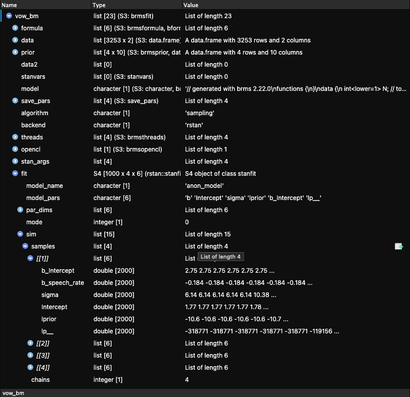

# Working with MCMC draws {#sec-regression-draws}

 

```{r}
#| label: setup
#| include: false

library(tidyverse)
theme_set(theme_light())
library(brms)
library(posterior)
```

## MCMC what?

Bayesian regression models aim to estimate the posterior probability distribution of all the model's parameters.
For example, in a simple regression, like the one from the previous chapter, we want to know which combinations of intercept, slope and $\sigma$ values are most plausible given our prior beliefs and the observed data.
More generally, if a model has many parameters, we want to know which combinations of values are plausible for all of them simultaneously.
This collection of probabilities is called the **joint posterior probability distribution** of the parameters.

For realistic regression models, determining this joint posterior distribution analytically (i.e. by solving Bayes' theorem mathematically) is often very difficult or even impossible.
Instead of calculating the posterior distribution directly, Bayesian software uses the **Markov Chain Monte Carlo (MCMC)** sampling algorithm to generate sampled values from it.
You first encountered MCMC in @sec-fit-model, when we run a Gaussian model with `brm()`: the text printed when running `brm()` is about the MCMC algorithm.
In the Stan software, which brms uses to fit Bayesian models, MCMC uses a specific implementation called Hamiltonian Monte Carlo (HMC).

The joint posterior distribution can be thought of as a multidimensional landscape, with one dimension for each parameter.
Since we humans find it difficult to think in more than three dimensions, let's stick with a Gaussian model like the one from @sec-fit-model.
This model had two parameters: the mean $\mu$ and the standard deviation $\sigma$.
With two parameters, the joint posterior distribution can be thought of as a three-dimensional landscape.
The *x*-axis represents values of the mean, the *y*-axis values of the standard deviation, and the *z*-axis (the vertical axis) the posterior probability density.
Hills correspond to highly probable combinations of mean and standard deviation values, whereas valleys correspond to unlikely combinations.
This landscape is determined by the two components of Bayes' theorem: the prior probability distribution, $P(h)$, and the probability of the data given the prior, $P(d \mid h)$.
Regions of high posterior probability of the are sampled more often than regions of low posterior probability, so the collection of sampled values approximates the joint posterior distribution.
The output of a Bayesian model is therefore not a single value for each parameter but a large collection of values, called the **posterior draws**, for each model parameter.

Hamiltonian Monte Carlo imagines a particle moving through this posterior landscape.
Its motion is guided by the shape of the landscape using equations from classical mechanics, allowing it to move efficiently between regions of high posterior probability.
At each step of this simulated motion, the algorithm records the particle's position as one **posterior draw**.
Each of these steps is called an **iteration**.
A sequence of iterations produced by the same simulation forms a **Markov chain** (or simply a chain).
In the three-dimensional landscape of an intercept and a slope, each draw therefore contains one mean value and one standard deviation value sampled together from the joint posterior distribution.
The algorithm repeats this process thousands of times, producing a large collection of posterior draws.
Looking only at the mean values across all draws gives the posterior distribution of the mean, while looking only at the standard deviation values gives the posterior distribution of the standard deviation.
Of course, in the type of regression model we have talked about in the previous chapter there are three parameters (intercept $\beta_0$, slope $\beta_1$, and $\sigma$) but we humans are not good at imagining more than three dimensions at a time so we will not attempt it, but the principle is the same.

::: callout-tip
## MCMC

The **joint posterior probability distribution** is the collection of the posterior probability distributions of all the parameters in the model.

**Markov Chain Monte Carlo** (MCMC) is an algorithm used to sample values from a joint posterior distribution.
Stan, used by brms, uses the Hamiltonian Monte Carlo implementation of MCMC.

The MCMC algorithm generates a set of values sampled from the joint posterior, called **posterior draws**.
:::

This description is necessarily simplified.
If you want to learn more about MCMC, I recommend @mcelreath2020, Ch.
9, and @nicenboim2025, Ch.
3.
However, to be a proficient user of brms and Bayesian regression models, you do not need to fully understand the mathematics behind MCMC, as long as you understand the basic conceptual idea.

When you run a model with brms, the posterior draws are stored in the model object returned by the `brm()` function.
Every operation on a fitted model, such as obtaining the output of `summary()` and plotting posterior distributions, is ultimately an operation on those draws.
By default, brms runs *four* MCMC chains.
The sampling algorithm within each chain performs 2,000 iterations.
The first half (1,000 iterations) are used to warm-up the algorithm by tuning parameters that govern the Hamiltonian dynamics, while the second half (1,000 iterations) are retained as posterior draws.
Since four chains each contribute 1,000 posterior draws, the fitted model contains 4,000 posterior draws that can be used to learn about the posterior distribution.
The rest of this chapter shows how to extract and manipulate these draws by revisiting the model fitted in @sec-regression.

## Reproducible model fit

Before we move to the model, it is worth making a couple practical considerations.
Fitting simple models with brms is relatively quick.
However, more complex models using larger data sets can take some time for the MCMC to efficiently sample the posterior distribution (sometimes even hours!).
It is useful to save the model fit to a file so that, once the model is fit once, you don't have to rune the MCMC algorithm again.
This can be done by specifying a file path in the `file` argument in the `brm()` function.
I suggest developing the habit of having a dedicated `cache/` in your Quarto project to save all of the brms model objects in.
Go ahead and create a `cache/` folder in your project.
Then, in your Quarto document, rewrite the model from the previous chapter like so:

```{r}
#| label: ita-egg
#| include: false

load("data/coretta2018a/ita_egg.rda")

ita_egg_clean <- ita_egg |> 
  drop_na(v1_duration)
```

```{r}
#| label: vow-bm-file

vow_bm <- brm(
  # `1 +` can be omitted.
  v1_duration ~ speech_rate,
  family = gaussian,
  data = ita_egg_clean,
  cores = 4,
  seed = 20912,
  file = "cache/vow_bm"
)
```

The `file` argument tells brms to save the model output to the `cache/` folder in a file called `vow_bm.rds`.
The extension `.rds` is appended automatically (this is the same file type you encountered where reading data, like `glot_status.rds`).
What about `cores` and `seed`?
When the model is fit, four MCMC chains are run.
By default, these are run sequentially: the first chain, then the second, then the third and finally the fourth.
But we can speed things up a bit by running them in parallel on separate computer cores.
Virtually all computers today have at least four cores, so we can run the four chains using four cores.
This is what `cores = 4` does: it tells brms to run each chain on one core so they are run in parallel.
Since the MCMC algorithm contains a random component (physical particles are randomly flicked across the landscape), every time you refit the model, a different set of draws are drawn.
One way to make the model reproducible (meaning, obtaining the same draws every time) is to set a "seed".
In computing, a seed is a number used for random number generation: when set, the same list of "random" numbers is produced.
The MCMC algorithm uses random number generation to run itself, so by setting the seed we are in fact "fixing" the randomness of the algorithm.
The seed number can be any number: here I set it to `20912`.

Now run the model.
The model will be fitted and the model object will be saved in `cache/` with the file name `vow_bm.rds`.
If you now re-run the same code again, you will notice that `brm()` does not fit the model again, but rather reads it from the file (no output is shown, but trust me, it works!).
This saves time: you fit the model once but you can read the output multiple times.
This is also good for reproducibility: an independent researcher with access to your code and the cache folder can run your code and get the same results as yours.[^ch-regression-draws-1]

[^ch-regression-draws-1]: In practice, even when setting the seed, you might get very slightly different results depending on the hardware and operating system.
    These are usually minuscule and do not impact the overall results.
    See <https://mc-stan.org/docs/reference-manual/reproducibility.html> if you are interested in the computational aspects.

::: callout-important
When you save the model fit to a file, R does not keep track of changes in the model specification (like changes in formula or data and so on), so if you make changes to the model, you need to **delete the saved model file** before re-running the code for the changes to have effect!
:::

## Extract MCMC posterior draws

The draws are stored in the model object `vow_bm`.
This object is actually a list of other objects, and you can inspect it by clicking on `vow_bm` in the Environment panel of RStudio.
After clicking, the object will appear in the Viewer panel.
You can see what looks like in @fig-brms-model-object.
There, click on the blue arrow next to `fit`, more objects will be revealed.
Then click on `sim` and `samples`.
The samples object is a list of four objects (`[[1]]`, `[[2]]`, `[[3]]`, `[[4]]`: each object contains the draws from each Markov chain, for each parameter (plus other things you shall not worry about).
The parameters of the model are `b_Intercept`, `b_speech_rate` and `sigma`.
These correspond to $\beta_0$, $\beta_1$ and $\sigma$ in the model formulae.
Notice that the first two parameters start with a `b_`.
This is because we represent regression coefficients with $\beta$, so we can easily distinguish regression parameters in the object from other parameters.

{#fig-brms-model-object fig-align="center" width="500"}

Each parameter has 2000 draws (values): these are the 1000 draws from the 1000 warm-up iterations plus the 1000 draws from the 1000 sampling iterations.
As mentioned above, all operations on draws are done on the post- warm-up draws (the warm-up draws are discarded).

There are different ways to extract the (post- warm-up) MCMC posterior draws from a fitted model.
In this book, we will use the `as_draws_df()` function from the [posterior](https://mc-stan.org/posterior/) package.
The function extracts the draws from a Bayesian regression model object and outputs them as a data frame.
Before we extract the draws from the `vow_bm` model, let's revisit the summary.

```{r}
#| label: vow-bm-summary

summary(vow_bm)
```

The `Draws` information in the summary are exactly that: information on the MCMC draws of the model.
It says 4 chains were run each with 2000 iterations of which 1000 used for warm-up.
`thin = 1` just tells brms to keep all the post-warm-up draws, and it's fine as is so you can just ignore it.
Then the summary tells us that there are 4000 total post-warm-up draws.
We are good to go!
We can extract the MCMC draws from the model using the `as_draws_df()` function.
This function returns a data frame (more specifically a tidyverse tibble with class `draws_df`) with values from each draw of the MCMC algorithm.
Since there are 4000 post-warm-up draws, the tibble has 4000 rows.

```{r}
#| label: vot-bm-draws

vow_bm_draws <- as_draws_df(vow_bm)
vow_bm_draws
```

Ignore the `Intercept`, `lprior` and `lp__` columns, they are for internal safekeeping.
Open the data frame in the RStudio viewer.
You will see three extra columns: `.chain`, `.iteration` and `.draw` (which are mentioned in the message printed with the tibble).
They indicate:

- `.chain`: The MCMC chain number (1 to 4).
- `.iteration`: The iteration number within chain (1 to 1000).
- `.draw`: The draw number across all chains (1 to 4000).

Make sure that you understand these columns in light of the MCMC algorithm.
The following columns contain the drawn values at each draw for three parameters of the model: `b_Intercept`, `b_speech_rate` and `sigma`.
To remind yourself what these mean, let's have a look at the mathematical formula of the model.

$$\begin{aligned}
vdur & \sim Gaussian(\mu, \sigma) \\
\mu        & = \beta_0 + \beta_1 \cdot sr \\
\end{aligned}$$

So:

- `b_Intercept` is $\beta_0$. This is the mean vowel duration when speech rate is zero.
- `b_speech_rate` is $\beta_1$. This is the *change* in vowel duration for each unit increase of speech rate.
- `sigma` is $\sigma$. This is the overall standard deviation of vowel duration (the standard deviation of the residual error).

Any inference made on the basis of the model are inferences derived from the draws.
One could say that the model "results" are, to put it simply, these draws and that the draws can be used to make inferences about the population one is investigating.

## Summary measures of the posterior draws

The `Regression Coefficients` table from the `summary()` of the model reports summary measures calculated from the drawn values of `b_Intercept` and `b_speech_rate`.
These summary measures are the mean (`Estimate`), the standard deviation (`Est.error`) of the draws and the lower and upper limits of the 95% Credible Interval (CrI).
We can obtain those same measures ourselves from the data frame with the draws, `vow_bm_draws`.
Let's calculate the mean and SD of `b_Intercept` and `b_speech_rate` (we round to the second digit with `round(2)`).

```{r}
#| label: vow-bm-draws-summ-1

# Intercept
mean(vow_bm_draws$b_Intercept) |> round(2)
sd(vow_bm_draws$b_Intercept) |> round(2)

# Speech rate
mean(vow_bm_draws$b_speech_rate) |> round(2)
sd(vow_bm_draws$b_speech_rate) |> round(2)

```

Compare the values obtained now with the values in the model summary above.
They are the same, because the summary measures in the model summary are simply summary measures of the draws.
What if we want to calculate the Credible Intervals (CrIs)?
In @sec-gaussian, you learned about the quantile function (the inverse CDF) to calculate intervals from *theoretical* distributions.
However, here we need to calculate intervals from a sample of posterior draws: the MCMC draws.
Note that central probability intervals of posterior draws are called Credible Intervals in Bayesian statistics, so CrI is just a specific type of interval.
To obtain intervals from samples we can use the `quantile2()` function from the posterior package.
This function takes two arguments: `x`, a vector of values to calculate the interval of, and `probs`, a vector of probabilities, like `qnorm()`.
By default, `probs = c(0.05, 0.95)`.
This gives you a 90% CrI interval, but the model summary returns by default a 95% CrI.
For a 95% CrI, we need the 2.5th percentile and the 97.5th percentile: `c(0.025, 0.975)`.
Here's the code:

```{r}
#| label: vow-bm-draws-summ-2

library(posterior)

# Intercept
quantile2(vow_bm_draws$b_Intercept, c(0.025, 0.975)) |> round(2)

# Speech rate
quantile2(vow_bm_draws$b_speech_rate, c(0.025, 0.975)) |> round(2)

```

Compare these values with the ones in summary: again they are the same.
Remember: a 95% CrI tells us that there is a 95% probability, given the model and data, that the value of the parameters is between the lower and upper limit of the interval.
So a 90% CrI tells us that there is an 90% probability that the value is between the lower and upper limit, a 60% interval that there is a 60% probability and so on.
We can also say that we are 95% confident that the value lies between the limits.
Intervals at lower level of probability are narrower (they span a smaller range of values) than intervals at higher level of probability: so a 95% CrI is always wider than an 80% CrI, which is wider than a 60% CrI and so on.
A narrower CrI means more *precision*: we have a more precise expectation of which range the parameter lies in.
But with more precision comes more uncertainty: a 60% CrI is more precise than a 95% CrI because it is narrower, but it is also more uncertain because we go from a 95% probability to a 60% probability.
This is the precision/confidence trade-off that we have to live with when doing research.
@vasishth2021 say (in the context of frequentist statistics): "\[we have to learn\] to accept the fact that—in almost all practical data analysis situations—we can only draw uncertain conclusions from data."

::: callout-warning
### Exercise 1

Calculate the 90%, 80% and 60% CrIs of `b_Intecept` and `b_speech_rate`.
:::

With this model, `vow_bm`, getting all of these CrIs might look trivial: the 95% CrIs are quite narrow, giving us quite a precise range of values for both the intercept and the coefficient of speech rate.
This is because there is quite a lot of data and the model is quite simple, there is only one predictor.
With more complex models and smaller data sets, uncertainty is greater and the intervals will span a large range of values.
We will see examples later in the book.
In those cases, it is helpful to be able to discuss CrIs at different levels of probability, since a lower-probability CrI might tell us something clearer about what we are investigating, while warning us of the increased uncertainty that comes with it.

## Plotting posterior draws

Plotting posterior draws is as straightforward as plotting any data.
You already have all of the tools to understand plotting draws with ggplot2.
To plot the reconstructed posterior probability distribution of any parameter, we plot the probability density (with `geom_density()`) of the draws of that parameter.
Let's plot `b_speech_rate`.
This will be the posterior probability density of the change in vowel duration for each increase of one syllable per second.
@fig-vow-bm-sr shows the posterior probability density of `b_speech_rate`.
If you compare this plot with the central panel of @fig-vow-bm, the density curves are identical.

```{r}
#| label: fig-vow-bm-sr
#| fig-cap: "Posterior probability distribution of `b_speech_rate`."

vow_bm_draws |>
  ggplot(aes(b_speech_rate)) +
  geom_density() +
  geom_rug(alpha = 0.2)
```

The [ggdist](https://mjskay.github.io/ggdist/index.html) package has some convenience ggplot geometries and stats for plotting posterior densities with CrIs.
The `stat_halfeye()` can shade the area under the curve depending on the specified interval levels, like in the code for @fig-vow-bm-sr-cris below, which shows 50%, 80% and 95% CrIs.
Below the density curve there are error bars of increasing thickness, each corresponding to a CrI.
The large dot represents the *median* of the draws (rather than the mean, like in the model summary).
The median is another acceptable summary measure for posteriors.

```{r}
#| label: fig-vow-bm-sr-cris
#| fig-cap: "Posterior probability distribution of `b_speech_rate` with credible intervals."
#| warning: false
#| message: false

library(ggdist)

vow_bm_draws |>
  ggplot(aes(x = b_speech_rate)) +
  stat_halfeye(
    .width = c(0.5, 0.8, 0.95),
    aes(fill = after_stat(level))
  ) +
  scale_fill_brewer(na.translate = FALSE) +
  geom_rug(alpha = 0.2)
```

The `aes(fill = after_stat(level))` requires a bit of explanation.
We are using `aes()` because we are mapping the fill of the shaded areas to some data, i.e. the level of the CrIs: 0.5, 0.8, 0.95.
These are specified in the `.width` argument.
The CrI are calculated by `stat_halfeye()` from the supplied `vow_bm_draws`, and the function creates, under the hood, a data frame with the interval limits and a column `level` which specifies the interval level.
So `after_stat(level)` is simply telling ggplot to use the `level` column for the fill from the data frame that is available *after* the stat (the halfeye) has been computed (if you want to know more, you can check the [aes_eval](https://ggplot2.tidyverse.org/reference/aes_eval.html) documentation from ggplot2).
You can learn more about ggdist visualisation tools on the [ggdist](https://mjskay.github.io/ggdist/index.html) website.

::: callout-warning
### Exercise 2

Plot the half-eyes of `b_Intercept` and `sigma`.
:::

## Expected value of the posterior predictive distribution {#sec-exp-val-ppd}

In a regression model, the mean $\mu$ of the outcome variable $y$ depends on the value of the predictor $x$.
In our `vot_bm` model, the mean of the vowel duration depends on the value of speech rate.

$$\begin{aligned}
vdur & \sim Gaussian(\mu, \sigma) \\
\mu        & = \beta_0 + \beta_1 \cdot sr \\
\end{aligned}$$

Since $\mu$ is conditional on the value of $sr$, it is also called the **conditional mean** or **expected value** (in mathematical notation $\mu = E(y \mid x)$, i.e the expected value of $y$ conditional on $x$, where $y$ is $vdur$ and $x$ is $sr$ in our model).
We can use the regression equation for $\mu$ to generate samples from the posterior distribution of $\mu$ by evaluating it at the posterior draws of $\beta_0$ and $\beta_1$ and at specific values of speech rate $sr$.
The resulting values are posterior draws of the expected value (or conditional mean) of $vdur$ given $sr$.

Here, evaluating means substituting specific numerical values into the regression equation.
Concretely, for each posterior draw of $\beta_0$ and $\beta_1$ we take a chosen value of speech rate $sr$, like 4 syllables per second, plug these numbers into the regression equation $\mu = \beta_0 + \beta_1 \cdot sr$, and compute the resulting value of $\mu$.
Repeating this for each posterior draw (there are 4000 in total) produces a set of values, each corresponding to one plausible realisation of the conditional mean implied by the model.
This collection of calculated posterior draws forms the posterior distribution of the expected value $E(y \mid x)$.

The expected value $E(vdur \mid sr)$ describes how the expected vowel duration varies as a function of speech rate, given the regression coefficients.
This quantity is obtained by evaluating $\mu$ at posterior draws of $\beta_0$ and $\beta_1$, and it captures uncertainty about the regression coefficients themselves.
However, this is not the same as the distribution of actual observed values of vowel duration.
To move from expected values to predicted data, we also need to take into account the residual variability represented by $\sigma$.
In brms, this leads to the **posterior predictive distribution**, which describes the distribution of possible values of $vdur$ for a given $sr$, combining uncertainty in the regression coefficients with the random variation around the mean captured by $\sigma$.
The *expected value of the posterior predictive distribution* refers to the average of these predicted outcomes, which coincides with the model-implied conditional mean/expected value $E(vdur \mid sr)$.

::: callout-tip
### Posterior predictive distribution and expected value of the posterior predictive distribution

The **posterior predictive distribution** is the distribution of possible observed values of the outcome for a given value of the predictor, obtained by combining uncertainty in the model parameters with the residual variability in the data.

The **expected value of the posterior predictive distribution** is the mean of the posterior predictive distribution for a given value of the predictor, which is equal to the model-implied conditional mean $E(y \mid x)$.
:::

Let's calculate the posterior distribution of the expected value of vowel duration using the model draws and the speech rate values of 4 and 7, just as an example.
These are more or less the minimum and maximum value of speech rate in the data, but we could use any value (of course, speech rate can't be negative so negative values wouldn't make sense, and very high values would also be physically impossible).
We can use `mutate()` to calculate posterior draws of the expected value.[^ch-regression-draws-2]

[^ch-regression-draws-2]: A terminological note: "posterior draws" is commonly used to refer both to the actual draws sampled by the MCMC algorithm, which you find in the model object, and to the values derived from the posterior draws (these are also called *derived quantities*).

```{r}
#| label: vow-bm-pred

vow_bm_draws <- vow_bm_draws |> 
  mutate(
    vdur_sr_4 = b_Intercept + b_speech_rate * 4,
    vdur_sr_7 = b_Intercept + b_speech_rate * 7,
  )

head(vow_bm_draws$vdur_sr_4)
head(vow_bm_draws$vdur_sr_7)
```

The two new columns `vdur_sr_4` and `vdur_sr_7` contains posterior draws of the expected value of vowel duration when speech rate is 4 and 7 respectively.
The `head()` code shows the first 10 values in the columns.
The code `vdur_sr_4 = b_Intercept + b_speech_rate * 4` (and the respective code for $sr = 7$) is based on $\mu = \beta_0 + \beta_1 sr$.
In the code, $sr$ is set to 4 (syllables per second).
So the mean vowel duration when speech rate is 4 syl/s is the intercept $\beta_0$ plus the slope $\beta_1$ times 4.
Since we are mutating a data frame where each row is one of the 4000 total draws, we are summing and multiplying the values within each row.
This gives us a new column `vdur_sr_4` (and `vdur_sr_7` when $sr = 7$) with 4000 predicted values of vowel duration, one per draw.
You can then get summary measures, CrIs and even plot the values of the predicted column, like you would with the coefficients columns `b_Intercept` and `b_speech_rate`.
The following code calculates the 95% CrI of the expected vowel duration when speech rate is 4 and 7 syl/s.

```{r}
#| label: vow-bm-pred-cri

quantile2(vow_bm_draws$vdur_sr_4, c(0.025, 0.975)) |> round()

quantile2(vow_bm_draws$vdur_sr_7, c(0.025, 0.975)) |> round()

```

Based on the model and data, the conditional mean (i.e. expected value) of vowel duration is 110-113 ms when speech rate is 4 syl/s and 44-49 ms when speech rate is 7 syl/s, at 95% probability (because it is a 95% CrI).

::: callout-tip
## Posterior draws of the expected value

In a Gaussian regression model, the **posterior draws of the posterior predictive distribution** are draws evaluated with the posterior distribution $Gaussian(\mu, \sigma)$ (these draws take into account the variability produced by $\sigma$ and include the uncertainty of the regression coefficients that make up $\mu$ and the uncertainty of $\sigma$).

The **posterior draws of the expected value** $E$ of the posterior predictive distribution are draws of $\mu$ (these draws do not take into account the variability produced by $\sigma$ and only include the uncertainty of the regression coefficients that make up $\mu$).
:::

## Plotting the expected values of vowel duration

<!-- TODO: add link to chapter that explains epred_draws() -->

It is common to plot the expected values of the outcome (here vowel duration) based on the value of the predictor (here speech rate).
One could manually calculate the expected value at several values of speech rate using the code above and plot them, but it is not very practical.
An alternative and quicker way to plot expected values is to use the `conditional_effects()` function from the brms package (you will learn how to calculate expected values efficiently in XXX).
The function calculates the expected values under the hood and plots a regression line of the mean expected value (the blue line) and a 95% CrI (the grey ribbon).
The range of values for the predictor is between the minimum and maximum values of the predictor in the data, and 100 equidistant values within the range are used by default (you can change this number with the `resolution` argument).
The result is @fig-vow-bm-cond.
The regression line has a negative slope: this means that with greater speech rate, vowel duration decreases.
The 95% CrI of the regression line in the plot indicates that we can be 95% confident that the mean vowel duration for different values of speech rate is within that interval.

```{r}
#| label: fig-vow-bm-cond
#| fig-cap: "Conditional mean (expected value) of vowel duration based on speech rate from a regression model."
#| message: false

conditional_effects(vow_bm, effects = "speech_rate")
```

If you wish to include the raw data in the plot, you can wrap `conditional_effects()` in `plot()` and specify `points = TRUE`.
Any argument that needs to be passed to `geom_point()` (these are all ggplot2 plots!) can be specified in a list as the argument `point_args`.
Here we are making the points transparent.

```{r}
#| label: fig-vow-bm-cond-1
#| fig-cap: "Conditional mean (expected value) of vowel duration based on speech rate from a regression model (repr.)."
#| message: false

plot(
  conditional_effects(vow_bm, effects = "speech_rate"),
  points = TRUE,
  point_args = list(alpha = 0.1)
)
```

This plot looks basically the same as @fig-vow-rate-lm.
Indeed, in @fig-vow-rate-lm we used `geom_smooth()` to add a regression line from a regression model.
A warning told us that this formula was used: `y ~ x`.
In the context of that plot, that means the smooth function fitted a regression model with speech rate as `x` and vowel duration as `y`.
This is because the aesthetics are exactly `aes(x = speech_rate, y = v1_duration)` (we didn't write the `x =` and `y =` because they are implied).
So `geom_smooth()` has fitted exactly the same model we have fitted with brms.
It might look trivial to fit a full model when you can just look at the regression line of `geom_smooth()`.
This is not the case for two reasons: first, you just see a regression line, but you don't know what the posterior distributions of the parameters are; second, with more complex scenarios, `geom_smooth()` falls short and can only produce regression lines based on very simple formulae like `y ~ x`.[^ch-regression-draws-3]

[^ch-regression-draws-3]: Technically, `geom_smooth()` uses `lm()` under the hood.
    This is a base R function that fits regression models using [maximum likelihood estimation](https://en.wikipedia.org/wiki/Maximum_likelihood_estimation) (MLE).
    This way of estimating regression coefficients is common in frequentist approaches to regression modelling and we will not treat it here.
    If you are interested about `lm()` and MLE, you can learn about these in @winter2020.

## Difference of expected values at specific predictor values

In @sec-exp-val-ppd we calculated the posterior draws of the expected value of vowel duration when speech rate is 4 and 7.
Assume we are interested in the *difference* between vowel duration when speech rate is 4 and when it is 7.
The `b_speech_rate` draws tell us the difference for one unit change in speech rate, so for example from 4 to 5 or from 6 to 7.
For the specific type of Gaussian regression model we fitted so far, you could multiply the draws of `b_speech_rate` by 3 to get the posterior draws of the difference of interest.
The calculated posterior draws of the difference would apply to any speech rate comparison of 3 units (4 to 7, 0 to 3, 6.5 to 9.5), but this is true only in very specific cases (like the one we've been discussing here) and doesn't generalise to all model types (in particular, it would not work with models that use a different family distribution, models with interactions of transformed variables, and so on).

Instead, since we have already calculated the posterior draws of the expected value of vowel duration above, we can simply take the difference of these: the resulting draws are the posterior draws of the difference in vowel duration when speech rate is 4 vs when it is 7.
That's what the following code does:

```{r}
#| label: vow-bm-diff

vow_bm_draws <- vow_bm_draws |> 
  mutate(
    diff_sr_4_7 = vdur_sr_7 - vdur_sr_4
  )

head(vow_bm_draws$diff_sr_4_7)
```

We can then calculate summary measures and CrIs and even plot the density of the posterior draws, as usual.
The following code calculates a 99% CrI.

```{r}
#| label: vow-bm-diff-cri

quantile2(vow_bm_draws$diff_sr_4_7, c(0.005, 0.995)) |> round()
```

The difference in vowel duration when speech rate is 4 vs 7 syl/s is -60 to -70 ms at 99% confidence (as always, conditional on the model and data).
@fig-vow-diff shows the posterior distribution of the difference.

```{r}
#| label: fig-vow-diff
#| fig-cap: "Posterior distribution of the difference in vowel duration at 4 vs 7 syl/s."

vow_bm_draws |> 
  ggplot(aes(diff_sr_4_7)) +
  geom_density(fill = "darkblue", alpha = 0.5) +
  labs(
    x = "Vowel duration difference (ms)",
    caption = "Difference when speech rate is 4 vs when it is 7 syl/s."
  )

```

## Summary

::: {.callout-note appearance="simple"}
- brms samples from the **joint posterior distribution** of the model's parameters using the Hamiltonian Monte Carlo implementation of the Markov Chain Monte Carlo (**MCMC**) algorithm.

- By default, 4 MCMC chains are run with 2000 iterations each, the first 1000 of which are for warm-up.

- The sampled values from the MCMC chains are the **posterior draws**.

- The posterior draws can be extracted from the model object with `as_draws_df()`.
  The posterior draws can be summarised and plotted.

- The **expected value** of the outcome is the mean of the outcome conditional on the value of the predictor, without the uncertainty from $\sigma$.
  Posterior draws of the expected value can be calculated from the model's posterior draws.

- The **posterior predictive distribution** describes the distribution of possible outcome variables based on the model, including the uncertainty from $\sigma$.

- The model-based expected values can be plotted with `conditional_effects()`.
:::
