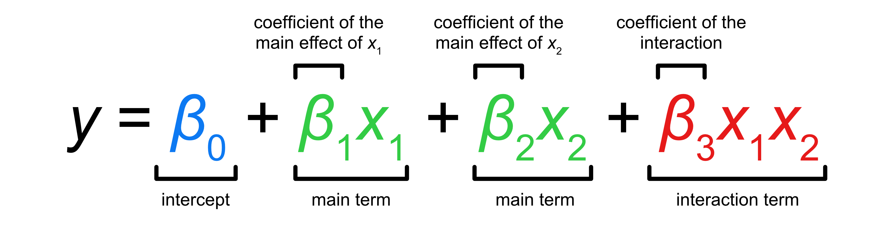

# Interactions in regression: two categorical predictors {#sec-regression-interaction}

 

The previous chapter explained how to include two predictors in a regression model and how to interpret the results of the model.
But we were left wondering: what if the effect of attitude differs between the two genders?
In this chapter we will talk about **interactions**: regression models can estimate different effects of one predictor depending on the levels of the other other predictor, by adding a so-called *interaction term*.
Keep reading to learn about them.

## Is the effect of attitude modulated by gender?

```{r}
#| label: setup
#| include: false

library(tidyverse)
theme_set(theme_light())
library(brms)
library(tidybayes)
library(posterior)
library(ggdist)
```

Let's start by attaching the packages and then reading and filtering the `polite` data [@winter2012].
We drop `NA` values from the `f0mn` column.

``` r
library(tidyverse)
theme_set(theme_light())
library(brms)
library(tidybayes)
library(posterior)
library(ggdist)
```

```{r}
#| label: polite
#| message: false

polite <- read_csv("data/winter2012/polite.csv")

polite_filt <- polite |> 
  drop_na(f0mn)
```

@fig-polite-f0-gend-att-repr-2 shows once again the mean f0 values split by gender and attitude.
In principle, we have no reason to expect that the effect of attitude will be the same in both genders, and conversely we have no reason to expect the opposite (that it will be different).
The best way to address this in regression modelling is to allow the model to estimate the (possible) difference.
A common misconception in the traditional way of running regression models is that if an interaction term indicates that there is no interaction, then it is fine to drop the interaction term from the model.
However, you can only estimate the interaction by including it in the model and after you do that there is no reason to run a new model without it if you believe there is no interaction.
So my general suggestion is to include interactions terms if you think it makes sense to expect an interaction, even if just in theory.

```{r}
#| label: fig-polite-f0-gend-att-repr-2
#| fig-label: "Mean f0 by gender and attitude (repr)."
#| code-fold: true

polite_filt |> 
  ggplot(aes(gender, f0mn, colour = attitude)) +
  geom_jitter(alpha = 0.7, position = position_jitterdodge(jitter.width = 0.1, seed = 2836))
```

## Interaction terms

To allow a regression model to estimate "interactions" between predictors, or in other words to estimate different effects of one predictors based on the levels of the other, we need to include so-called **interaction terms**.
An interaction term, is a model term that tells the model to estimate interactions.
Before we see how to include interaction terms in R/brms, let's go through the model's formula.

We will model mean f0 `f0mn` as a function of `gender` and `attitude` and an interaction between the two.
Here is what the formula looks like:

$$\begin{aligned}
f0mn_i & \sim Gaussian(\mu_i, \sigma)\\
\mu_i & = \quad \beta_0 \\
 & \quad + \beta_1 \cdot gen_{\text{M}[i]} \\
 & \quad + \beta_2 \cdot att_{\text{POL}[i]} \\
 & \quad + \beta_3 \cdot gen_{\text{M}[i]} \cdot att_{\text{POL}[i]}
\end{aligned}$$

There are now not just three $\beta$ coefficients, but four: $\beta_0, \beta_1, \beta_2, \beta_3$.
The new coefficient that we haven't seen before is $\beta_3$.
This is the coefficient of the interaction term of gender and attitude.
It is common to refer to the coefficients $\beta_1$ and $\beta_2$ as the coefficients of the **main effects** of gender and attitude respectively, and to $\beta_3$ as the coefficient of the **interaction** between gender and attitude.
Let's work out the formula of $\mu$ depending on the combinations gender and attitude: remember that $gen_\text{M}$ is 0 for female and 1 for male, and $att_\text{POL}$ is 0 for informal and 1 for polite.

|                     |                                         |
|---------------------|-----------------------------------------|
| female and informal | $\beta_0$                               |
| male and informal   | $\beta_0 + \beta_1$                     |
| female and polite   | $\beta_0 + \beta_2$                     |
| male and polite     | $\beta_0 + \beta_1 + \beta_2 + \beta_3$ |

We get this because when either $gen_\text{M}$ or $att_\text{POL}$ are 0, the corresponding $\beta$ coefficient gets dropped from the equation.
Importantly, notice how for male/polite we need all four coefficients.
For male and polite mean f0, we need the coefficient for male $\beta_1$ and that for polite $\beta_2$, but also the interaction coefficient $\beta_3$ because in this combination $gen_\text{M}$ and $att_\text{POL}$ are both 1.
You can think of $\beta_3$ as the "adjustment" to the individual effects of gender = male and attitude = polite.
In other words, the interaction coefficient $\beta_3$ tells you how the combined effects of gender = male and attitude = polite differ from their simple sum (i.e. $\beta_1 + \beta_2$).

::: callout-warning
## Exercise 1

Go to [Regression Models Illustrated](https://stefanocoretta.shinyapps.io/lines/) and play with the "Categorical + Categorical" tab.
:::

Moving on to R, we can include an interaction term between `gender` and `attitude` in the R formula with `gender:attitude` (the two predictors separated by a colon `:`).
Similarly to how we refer to the coefficients in a model with interactions, we call the `gender` and `attitude` terms in the R formula the **main terms** and `gender:attitude` as the **interaction term**.

```{r}
#| label: f0-bm-int

f0_bm_int <- brm(
  f0mn ~ gender + attitude + gender:attitude,
  family = gaussian,
  data = polite,
  cores = 4,
  seed = 7123,
  file = "cache/ch-regression-interaction_f0_bm_int"
)
```

Note that there is a [syntactic sugar](https://en.wikipedia.org/wiki/Syntactic_sugar) for interactions: instead of writing in full `gender + attitude + gender:attitude` you can just write `gender * attitude` (the two predictors separated by a star `*`).
The "star" syntax expands to the full syntax under the hood when the model is run.
It is up to you which syntax you use, although for beginners I suggest using the longer one for clarity.
Getting a regression model to estimate interactions is easy, but a warning: because we have included an interaction in the model, the interpretation of the coefficients has changed slightly relative to how we interpret the coefficients of categorical predictors in models without interactions!

::: callout-tip
## Interactions

{fig-align="center" width="500"}

An **interaction term** allows the effect of one predictor to vary depending on the value of the other predictor.

A model with an interaction has **main terms** and an **interaction term**.
The coefficients of the main terms are the **coefficients of the main effects** while the coefficient of the interaction term is the **interaction coefficient**.
:::

## Interpreting models with interactions

Let's look at the model summary.
With interactions, the coefficients of categorical predictors are interpreted slightly differently than when there are no interactions.

```{r}
#| label: f0-bm-int-summary

summary(f0_bm_int)

```

- `Intercept` is $\beta_0$: this is, as you would expect, the mean f0 when gender and attitude are at their reference levels, i.e. female and informal.
  According to the model, there is a 95% probability that the mean f0 is between 246 and 267 Hz with female speakers and informal attitude.

- `genderM` is $\beta_1$, the coefficient of the main effect of gender: this is the difference in mean f0 between male and female gender, *when attitude is informal* (i.e. at the reference level of attitude).
  This differs from the interpretation in models with no interactions where instead the coefficient would capture the *average* difference between male and female gender.
  According to the model, the mean f0 is 105 to 134 Hz lower in male than in female participants, when the attitude is informal.

- `attitudepol` is $\beta_2$, the coefficient of the main effect of attitude: this is the difference in mean f0 between polite and informal attitude, *when gender is female* (i.e. at the reference level of gender).
  This also differs from the interpretation in models with no interactions where instead the coefficient would capture the *average* difference between polite and informal attitude.
  According to the model, the mean f0 is 3 to 32 Hz lower in polite than in informal speech, in female speakers.

- `genderM:attitudepol` is $\beta_3$: this is the interaction coefficient.
  This coefficient tells you the *adjustment* you have to make to the effects of gender and attitude (so $\beta_1 +\beta_2 + \beta_3$), on top of what is predicted by the additive effects of gender and attitude (so $\beta_1 + \beta_2$).
  According to the model, the difference between female informal and male polite speech differs from the additive effect of gender and attitude by -14 to +27 Hz, at 95% confidence.
  The 95% CrI \[-14, +27\] spans both negative and positive values: there is uncertainty as to whether the effect of attitude differs in the two genders (and, symmetrically, whether the effect of gender differs in informal and polite speech), and as to weather the difference is positive or negative.
  The interval might indicate that a positive difference is more likely, given that the interval spans a wider range of positive values than negative values.

Let's extract the model's draws and process them to get summary measures and relevant plots.

## Model's draws and expected values

We can extract the draws from the model object as usual.

```{r}
#| label: f0-bm-int-draws

f0_bm_int_draws <- as_draws_df(f0_bm_int)
```

To calculate the expected values of f0, we plug in the columns from the draws object `f0_bm_int_draws` according to the model's formula.
To name the new columns with the expected predictions, we use `F` for female and `M` for male for gender, and `inf` for informal and `pol` for polite for attitude.
Note that, since the name of interaction coefficient `b_genderM:attitudepol` contains a colon `:`, we need to surround it with back-ticks to prevent R for interpreting the colon `:` as the range operator (like in `1:5`, which returns integers from 1 to 5).

```{r}
#| label: f0-bm-int-draws-2

f0_bm_int_draws <- f0_bm_int_draws |> 
  mutate(
    # \beta_0
    F_inf = b_Intercept,
    # \beta_0 + \beta_1
    F_pol = b_Intercept + b_attitudepol,
    # \beta_0 + \beta_2
    M_inf = b_Intercept + b_genderM,
    # \beta_0 + \beta_1 + \beta_2 + \beta_3
    M_pol = b_Intercept + b_genderM + b_attitudepol + `b_genderM:attitudepol`
  )
```

Let's plot the distributions of the expected values we just calculated.
We need to pivot the draws object: to make plotting easier, we need a column with the gender value and one column with the attitude value, and also a column with the expected values.
We can split the `cond` column with `separate()` from dplyr.
This function splits strings by punctuation characters, like `_`, so it works with strings like `F_inf`, which gets split into `F` and `inf`.
The two new values are input into the specified new columns `gender` and `attitude` (the user picks and specifies the column names as one of the arguments).

```{r}
#| label: f0-bm-int-epred
#| warning: false

f0_bm_int_epred <- f0_bm_int_draws |> 
  # First, select only the columns we need to pivot
  select(F_inf:M_pol) |> 
  # From wide to long
  pivot_longer(F_inf:M_pol, names_to = "cond", values_to = "epred") |> 
  # Split `cond` column to make a gender and an attitude column
  separate(cond, c("gender", "attitude"))

f0_bm_int_epred
```

There is also a swifter way to calculate expected values, which we encountered previously: using the `epred_draws()` function from tidybayes.
I recommend that you practice calculating the expected values manually as we have done above, because it makes it explicit how the expected values derive from the model coefficients.
Let's use `epred_draws()` now.

The first step is to create a prediction grid.
Instead of writing down the combinations of gender and attitude by hand, we can use `expand_grid()` from tidyr.
The function takes a name-value pairs.
The names correspond to the column names in the resulting tibble.
This tibble will have one row for each combination of the values in the name-value pairs.
See the output of the code below.

```{r}
#| label: epred-grid

epred_grid <- expand_grid(
  gender = c("F", "M"),
  attitude = c("inf", "pol")
)
epred_grid
```

Note that the prediction grid must use *exactly* the same variable and value names as the ones of the data used in the model.
Our prediction grid now has two columns, `gender` and `attitude`, and four rows, one for each combination of gender and attitude.
When your predictors have many levels, it would be tedious to write down the combinations yourself and `expand_grid()` makes a useful shortcut.

With the prediction grid, we can now obtain the posterior draws of the expected values using `epred_draws()`.

```{r}
#| label: f0-bm-int-epred-2

f0_bm_int_epred_2 <- epred_draws(
  f0_bm_int,
  epred_grid
)
f0_bm_int_epred_2
```

Something that makes this method convenient is that the resulting tibble is already "longer" so there is no need to pivot it for plotting.

Now we can plot the expected values with ggplot2 (@fig-f0-bm-int-epred).
We set `scales = "free_x"` in `facet_grid()` to allow ggplot to use different scales in the *x*-axis (try to run the code without specifying the `scales` argument to see why).

```{r}
#| label: fig-f0-bm-int-epred
#| fig-cap: "Density plot of the expected values of mean f0 by gender and attitude."

f0_bm_int_epred_2 |> 
  ggplot(aes(.epred, attitude)) +
  stat_halfeye() +
  facet_grid(cols = vars(gender), scales = "free_x") +
  labs(x = "Mean f0 (Hz)")

```

An alternative to `stat_halfeye()` is `stat_interval()`.
By default, it plots the 50-80-95% CrIs.
@fig-f0-bm-int-epred-interval shows the CrIs of the expected values of mean f0.

```{r}
#| label: fig-f0-bm-int-epred-interval
#| fig-cap: "Intervals plot of the expected values of mean f0 by gender and attitude."

f0_bm_int_epred_2 |> 
  ggplot(aes(attitude, .epred)) +
  stat_interval() +
  facet_grid(cols = vars(gender))
```

We can observe two main things:

- The f0 of female participants is generally higher than that of male participants.

- In both genders, f0 is somewhat higher in informal than in polite speech.

- Possibly, the attitude difference is somewhat larger in female than in male participants.

These general observations can be quantified using CrIs from the model.
For example, let's take the attitude difference in male speakers.
We can compute the posterior draws of this difference from the expected values in `f0_bm_int_draws` and take summary measures.

```{r}
#| label: f0-bm-int2-draws-summarise

f0_bm_int_draws |> 
  mutate(
    M_pol_inf = M_pol - M_inf
  ) |> 
  summarise(
    mean_diff = mean(M_pol_inf), sd_diff = sd(M_pol_inf),
    lo_diff = quantile2(M_pol_inf, probs = 0.025),
    hi_diff = quantile2(M_pol_inf, probs = 0.975)
  ) |>
  round()
```

The mean difference in polite vs informal speech in male speakers is -11 Hz (SD = 8) and the 95% CrI is \[-27, +5\] Hz.
This is somewhat indicative of a difference (polite speech is produced with a somewhat lower f0) but it is also possible that there is instead a smaller positive difference (+5 Hz).
Comparing this with the effect of attitude in female participants (as given by $\beta_2$ or `attitudepol`) which is at 95% confidence between -32 to -3 Hz, we cannot really argue for or against the effect of attitude being different in the two genders.
In other words, we are left with a certain level of uncertainty.

The $\beta_3$ coefficient estimates the difference in the difference of attitude in males vs female participants, so we can estimate the uncertainty of the difference by calculating CrIs of the coefficient.

```{r}
#| label: gender-attitude-cri

f0_bm_int_draws |> 
  summarise(
    mean = mean(`b_genderM:attitudepol`) |> round(),
    sd = sd(`b_genderM:attitudepol`) |> round(),
    `95%` = paste0("[", paste(quantile2(`b_genderM:attitudepol`, c(0.025, 0.975)) |> round(), collapse = ", "), "]"),
    `80%` = paste0("[", paste(quantile2(`b_genderM:attitudepol`, c(0.1, 0.9)) |> round(), collapse = ", "), "]"),
    `70%` = paste0("[", paste(quantile2(`b_genderM:attitudepol`, c(0.15, 0.85)) |> round(), collapse = ", "), "]"),
    `60%` = paste0("[", paste(quantile2(`b_genderM:attitudepol`, c(0.2, 0.8)) |> round(), collapse = ", "), "]"),
    `50%` = paste0("[", paste(quantile2(`b_genderM:attitudepol`, c(0.25, 0.75)) |> round(), collapse = ", "), "]")
  )
```

At 95% probability, given the 95% CrI of \[-14, +27\], the difference between attitudes in males is between 14 Hz lower and 27 Hz higher than the corresponding difference in females (the 95% CrI of which is \[-32, -3\]).
At 60% probability, the difference in males is between 2 Hz lower and 16 Hz higher (95% CrI \[-2, +15\]) than that in females.
While we can be quite confident that polite speech has a somewhat lower mean f0 in females, this might be the case in male speakers too although possibly to a lower degree and considering there might be no difference by attitude in males.
We are just very uncertain about it.

## Reporting

The following paragraph shows you how to report the model specification of the model we fitted in this chapter.
I don't include the part where you report the results of the model, because it would just be repeating the text from the previous sections.

> We fitted a Bayesian regression model using the brms package [@burkner2017] in R [@rcoreteam2025].
> We used a Gaussian distribution for the outcome variable, mean f0 (in Hz).
> We included attitude (informal vs polite) and gender (female vs male) as the regression predictors and their interaction.
> Both predictors were coded using the default R treatment contrasts, with informal and female set as the reference levels.

Note that there isn't a single "right" way of reporting model results, or a fixed procedure.
It much depends on the specific research question and on which part of the results you place focus on.
Generally speaking, you should report credible intervals at various levels of probability, mean and SD and include plots (density or interval plots) of regression coefficients, expected values, and of other comparisons (not already covered by the regression coefficients).
With more complex models, including all that in a report might be too much so you can take advantage of tables and appendices: for example, you can refer the reader to a table containing summaries of the regression coefficients and only directly report relevant CrIs in the text, accompanied by some plots of relevant posterior distributions.

## Summary

::: {.callout-note appearance="minimal"}
- Interaction terms allow us to estimate how the effect of one predictor differs based on the levels of another.

- Interpretation of a coefficient for any one predictor is thus based on the reference level of the other predictors.

- We can still calculate expected predictions and any comparison of interest based on the model's draws.
:::
