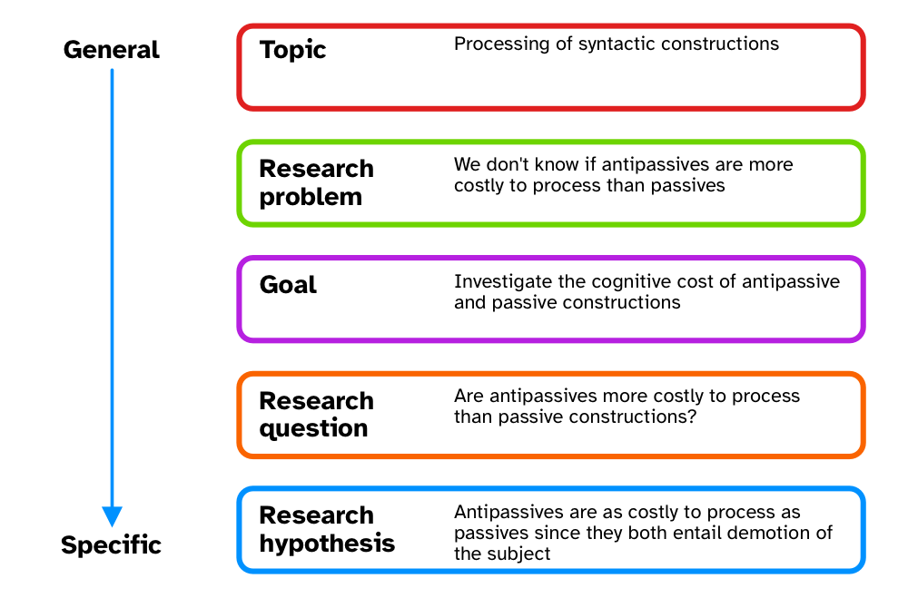

# A workflow for quantitative studies {#sec-workflow}

 

This chapter is an overview of a workflow we suggest researchers follow while planning and executing quantitative studies.
Note that the proposed workflow also includes concepts and procedures that have not been treated in the textbook.
In such cases, references to relevant resources are provided.
The workflow assumes a Bayesian inference approach.
We also recommend @gelman2020 and @schad2021 as complementing approaches, and @gelman2026a for a book-length treatment.

## Define your research questions/hypotheses

{fig-align="center"}

In @sec-res-context, we introduced the research context framework proposed by @ellis2008.
The framework is an aid to defining the object of study, from a more general perspective (the topic) down to a specific research question and hypothesis.
This step normally takes up a large chunk of research time, since this is when researchers spend time reading and synthesising relevant literature.
At the end of this stage, you should have *precise and testable research questions* and, if appropriate, *research hypotheses*.
This includes carefully thinking about the definition of the words and concepts in the RQs/RHs [@morin2015; @flake2020; for a realistic-positivistic view, see @devezer2019; @devezer2021], what your population is, and how your positionality informs all this [@jafar2018; @darwinholmes2020; @castanelli2024].

## Build a causal graph

Correlation is not causation, but it is if one adopts a Causal Inference approach (@sec-next-causal).
Most quantitative research, while not necessarily framed in causal terms, is ultimately about causality [@mcelreath2020].
Statistical model are often used as a substitute to proper causal thinking: this approach can however lead to biased estimates [@arif2022; @lewer2025].
Directed Acyclic Graphs (DAGs) are a formalised way of visually laying out causal relationships between variables.
DAGs can be used to inform statistical modelling in a principled way, by allowing researchers to identify necessary outcome and predictors variables that should be included in the model.
A useful tool for the development of DAGs is DAGitty, available at <https://www.dagitty.net>.
This online software allows you to input variables and link them based on causality.
The software also provides you with so-called "adjustment sets" based on the specified DAG: adjustment sets are sets of variables that should be included as predictors in a regression model to estimate specified direct causal effects.
As mentioned in @sec-next-causal, to learn about Causal Inference and Directed Acyclic Graphs, see @mcelreath2020 Ch 5-6 (and subsequent) and the YouTube video-lectures: <https://www.youtube.com/playlist?list=PLDcUM9US4XdPz-KxHM4XHt7uUVGWWVSus>.

## Simulation, prior specification and model checks

Once you have clearly defined RQs/RHs and have built a DAG, you should simulate data based on the implied generative process (the real-world process that you think produces the target behaviour being investigated) and check that the specified statistical model correctly recovers the parameter values used in simulating data.
Model checks require that you first specify prior probability distributions for each parameter in the statistical model.
Priors should be defined based on previous studies and/or expert knowledge (see @sec-next-priors for relevant references).
Prior predictive checks involve assessing whether the defined priors produce data whose joint posterior distribution is qualitatively similar to the expected distribution based on prior studies and expert knowledge.
This usually requires iterating over several steps of setting priors and checking the resulting joint posterior, refining priors if necessary and checking the joint posterior again, and so on.

Once the researcher is satisfied with the prior predictive checks, then they can use the chosen priors in the chosen regression model to check that the model works as expected.
"Working as expected" means two things: first, the model should run and converge without issues from a purely computational perspective; second, the model should correctly recover the parameters values used in the data simulation.
Non-converging models might require adjustments in prior or model structure specification.
Models that do not recover the original parameter values used in the data simulation should be adjusted until they do.

## Sample size estimation

Estimating the sample size necessary to reach the desired precision in the estimates of interests is not necessarily a separate step than the data simulation and model checks from the previous section, but it is worth mentioning it separately.
Data simulation can be used for this purpose.
See @sec-next-size for an overview of approaches.
The outcome of the procedure is an estimate of how much data you need to collect to reach the desired estimate precision (posterior distributions along a narrower range of values are more precise than posterior distributions that are very wide, but there isn't a threshold).
On top of a sample size objective (for example, you need data from at least 50 participants), you can further set criteria in a "stopping rule" to stop data collection at predefined points.
For example, "either we will reach the necessary sample size of 50 participants or we will stop after 3 months of data collection".
You should justify all criteria in the stopping rule in your write-up.

## Registered Reports or pre-registration

At this point, you have two options: you can preregister your study design and analysis plan or you can proceed with writing a Stage 1 manuscript and go the Registered Report route (see @sec-open-research).
You will have to consider sharing and licensing the research compendium (at the current stage and especially at study completion).

If you are just preregistering the study, you can start data collection after the registration.
If you went the RR route, you need to wait for In Principle Acceptance.
The following steps will imply either of these events have taken place.

## Collect your data

You should now proceed with running your study and collecting the data based on the registered plan.
If you had specific stopping rules, you should stop if you hit one of the criteria, whichever is hit first.

## Run your planned analysis

You now run your planned (registered) analysis.
Exploratory (non-registered analyses) are allowed, provided they are flagged as such in your manuscript.
The following sections break down the different analysis steps.

### Data checks

You should carefully check your data, from raw files to when you read them in R.
A lot of things can go wrong and you wouldn't want to run an analysis on data that have problems.
After reading the data in R, run data checks like listing the levels of categorical variables, getting ranges of numeric variables, and plotting the raw variables (using a variety of plot types) to ensure things are as you expect them.
For example, if you know that one variable cannot have negative values, like RTs, but there data contains negative values, you should address that.

### Data processing

Depending on the design, you might need to further process the data.
You should proceed with your data processing steps and at each step run data checks again on the processed data, to ensure processing didn't introduced errors.
We didn't talk about variable transformation much, apart from logging predictors like frequencies, but data processing also includes variable transformation in preparation of statistical modelling.

### Data summaries and plotting

Once you are sure the data doesn't contain obvious errors, you should proceed with obtaining summary measures of your variables and plotting the variables to investigate patterns, guided by your research questions/hypotheses.

Note that in real-world contexts, data checks, processing, summaries and plotting are not necessarily performed linearly and you might have to move back and forth between them.

### Run your statistical models

You can now run your statistical models.
Make sure you are using the correct data.

### Model diagnostics, posterior predictive checks and prior sensitivity analysis

Your models have finished running.
At this point, you should check the model diagnostics, run posterior predictive checks (for example, with `pp_check()`) and a prior sensitivity analysis to determine the goodness of fit of the model.
A principled way to run a prior sensitivity analysis is described in @betancourt2018 and @schad2021.

### Inspect and interpret the results

The results can now be interpret based on the RQs/RHs.
You should inspect the regression coefficients, the multilevel hyper-parameters if you fitted a multilvel model (aka mixed-effects model) and/or any other estimator of interest.
Inspect and plot posterior draws of coefficients, calculate and plot the posterior draws of expected values, the linear predictor, and/or the posterior predictive distribution.
You can further process the posterior draws by calculating comparisons or draws at specific predictor values and so on, depending on your RQs/RHs.

The key concept at this stage is "epistemic humility": interpretation should be commensurate to the degree of precision obtained and the strength of the evidence (mainly based on precision, but for alternatives see @gelman2020 and @schad2021).
If you are following an RR route, you would write your Stage 2 manuscript and submit it for Stage 2 review.

## The cycle begins again

Your study is completed and published.
Most often than not, the results open up other venues for investigation and follow-up studies can be developed.
The research cycle begins once again.
